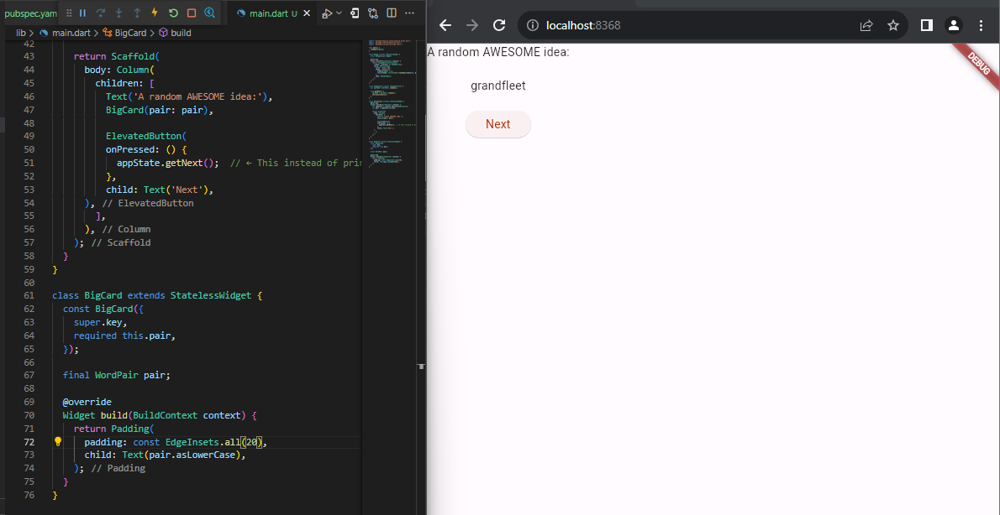
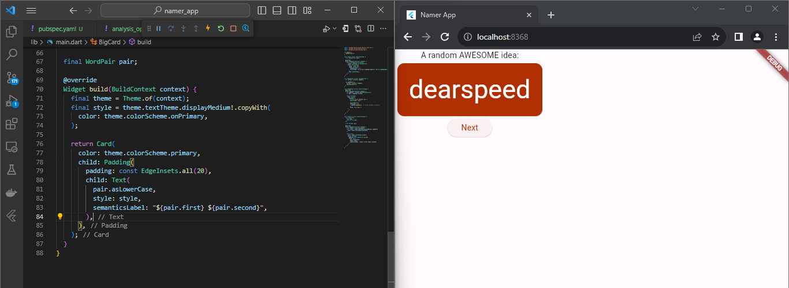
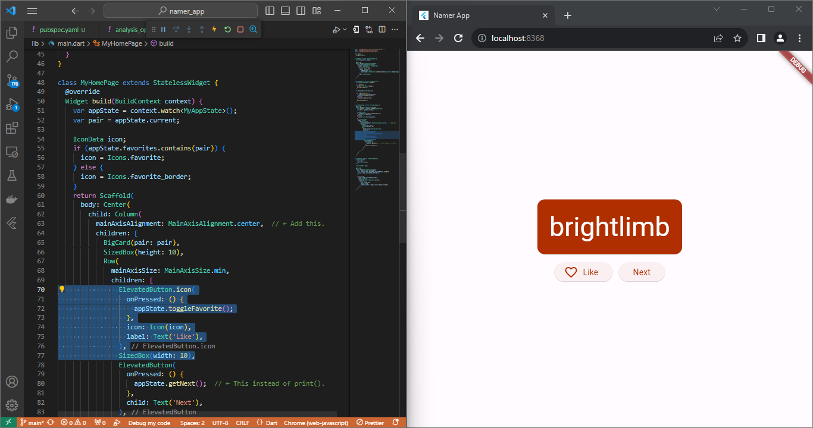

# Laporan Praktikum Pertemuan 5
## Flutter Fundamental

Zahra Annisa Wahono

3H/29
## **Tugas Praktikum : Codelabs**

### **Membuat Project**

Ganti konten file ini dengan kode berikut:

*pubspec.yaml*
```
name: namer_app
description: A new Flutter project.

publish_to: 'none' # Remove this line if you wish to publish to pub.dev

version: 0.0.1+1

environment:
  sdk: '>=2.19.4 <4.0.0'

dependencies:
  flutter:
    sdk: flutter

  english_words: ^4.0.0
  provider: ^6.0.0

dev_dependencies:
  flutter_test:
    sdk: flutter

  flutter_lints: ^2.0.0

flutter:
  uses-material-design: true
```


*analysis_options.yaml*

include: package:flutter_lints/flutter.yaml
```
linter:
  rules:
    prefer_const_constructors: false
    prefer_final_fields: false
    use_key_in_widget_constructors: false
    prefer_const_literals_to_create_immutables: false
    prefer_const_constructors_in_immutables: false
    avoid_print: false
```


*lib/main.dart*
```
import 'package:english_words/english_words.dart';
import 'package:flutter/material.dart';
import 'package:provider/provider.dart';

void main() {
  runApp(MyApp());
}

class MyApp extends StatelessWidget {
  const MyApp({super.key});

  @override
  Widget build(BuildContext context) {
    return ChangeNotifierProvider(
      create: (context) => MyAppState(),
      child: MaterialApp(
        title: 'Namer App',
        theme: ThemeData(
          useMaterial3: true,
          colorScheme: ColorScheme.fromSeed(seedColor: Colors.deepOrange),
        ),
        home: MyHomePage(),
      ),
    );
  }
}

class MyAppState extends ChangeNotifier {
  var current = WordPair.random();
}

class MyHomePage extends StatelessWidget {
  @override
  Widget build(BuildContext context) {
    var appState = context.watch<MyAppState>();

    return Scaffold(
      body: Column(
        children: [
          Text('A random idea:'),
          Text(appState.current.asLowerCase),
        ],
      ),
    );
  }
}
```


### **Menambahkan Tombol**

Tambahkan tombol di bagian bawah Column, tepat di bawah instance Text kedua.

*lib/main.dart*
```
return Scaffold(
  body: Column(
    children: [
      Text('A random AWESOME idea:'),
      Text(appState.current.asLowerCase),

      // ↓ Add this.
      ElevatedButton(
        onPressed: () {
          print('button pressed!');
        },
        child: Text('Next'),
      ),

    ],
  ),
);
```


Saat Anda menyimpan perubahan, aplikasi diperbarui kembali: Sebuah tombol muncul dan, saat Anda mengklik tombol tersebut, Konsol Debug di VS Code menampilkan pesan button pressed!.


**Kursus singkat Flutter 5 menit**

Meskipun menyenangkan melihat Konsol Debug, Anda ingin tombol tersebut melakukan sesuatu yang lebih berguna. Namun, sebelum mencapai ke sana, perhatikan kode pada lib/main.dart lebih dekat, untuk memahami cara kerjanya.

*lib/main.dart*
```
void main() {
  runApp(MyApp());
}
```
Di bagian paling atas file tersebut, Anda akan menemukan fungsi main(). Dalam wujudnya saat ini, fungsi ini hanya memberi tahu Flutter untuk menjalankan aplikasi yang ditentukan pada MyApp.

*lib/main.dart*
```
class MyApp extends StatelessWidget {
  const MyApp({super.key});

  @override
  Widget build(BuildContext context) {
    return ChangeNotifierProvider(
      create: (context) => MyAppState(),
      child: MaterialApp(
        title: 'Namer App',
        theme: ThemeData(
          useMaterial3: true,
          colorScheme: ColorScheme.fromSeed(seedColor: Colors.deepOrange),
        ),
        home: MyHomePage(),
      ),
    );
  }
}
```
Class MyApp memperluas StatelessWidget. Widget adalah elemen tempat Anda membangun setiap aplikasi Flutter. Seperti yang dapat Anda lihat, bahkan aplikasi itu sendiri adalah widget.

>Catatan: Kita akan mencapai penjelasan StatelessWidget (dibandingkan StatefulWidget) kemudian.

Kode pada MyApp menyusun keseluruhan aplikasi. Kode ini membuat status seluruh aplikasi (Anda akan mempelajari hal ini lebih lanjut nanti), memberi nama aplikasi, menentukan tema visual, dan mengatur widget "home"—titik awal aplikasi Anda.

*lib/main.dart*
```
class MyAppState extends ChangeNotifier {
  var current = WordPair.random();
}
```
Berikutnya, class MyAppState menentukan...yah...status aplikasi. Percobaan ini adalah percobaan pertama Anda menggunakan Flutter, jadi codelab ini akan menjaga status aplikasi tetap sederhana dan terpusat. Ada banyak cara ampuh untuk mengelola status aplikasi di Flutter. Salah satu yang paling mudah untuk dijelaskan adalah ChangeNotifier, pendekatan yang diambil oleh aplikasi ini.

MyAppState menjelaskan data yang diperlukan oleh aplikasi ini agar berjalan dengan baik. Saat ini, kode ini hanya berisi variabel tunggal dengan pasangan kata acak saat ini. Anda akan menambahkannya nanti.
Class status memperluas ChangeNotifier, yang artinya kode ini dapat memberi tahu kode lain tentang perubahannya sendiri. Misalnya, jika pasangan kata saat ini berubah, beberapa widget dalam aplikasi perlu mengetahuinya.
Status dibuat dan disediakan untuk seluruh aplikasi menggunakan ChangeNotifierProvider (lihat kode di atas pada MyApp). Hal ini memungkinkan widget mana pun pada aplikasi untuk mendapatkan status.


*lib/main.dart*
```
class MyHomePage extends StatelessWidget {
  @override
  Widget build(BuildContext context) {           // ← 1
    var appState = context.watch<MyAppState>();  // ← 2

    return Scaffold(                             // ← 3
      body: Column(                              // ← 4
        children: [
          Text('A random AWESOME idea:'),        // ← 5
          Text(appState.current.asLowerCase),    // ← 6
          ElevatedButton(
            onPressed: () {
              print('button pressed!');
            },
            child: Text('Next'),
          ),
        ],                                       // ← 7
      ),
    );
  }
}
```
Terakhir, ada MyHomePage, widget yang telah Anda modifikasi. Setiap baris bernomor di bawah memetakan ke komentar nomor baris pada kode di atas:

1. Setiap widget menentukan metode build() yang dipanggil secara otomatis setiap kali kondisi widget berubah agar widget selalu dalam kondisi terbaru.
2. MyHomePage melacak perubahan terhadap status aplikasi saat ini menggunakan metode watch.
3. Setiap metode build harus menampilkan widget atau (yang lebih umum) pohon widget bertingkat. Dalam hal ini, widget tingkat tertinggi adalah Scaffold. Anda tidak akan bekerja dengan Scaffold dalam codelab ini, tetapi ini adalah widget yang berguna dan dapat ditemukan di sebagian besar aplikasi Flutter di dunia nyata.
4. Column adalah salah satu widget tata letak paling dasar pada Flutter. Widget tata letak ini mengambil sejumlah turunan dan menempatkannya pada kolom dari atas ke bawah. Secara default, kolom menempatkan turunan-turunannya secara visual di bagian atas. Anda akan segera mengubah ini agar kolom terpusat di tengah.
5. Anda mengubah widget Text ini pada langkah pertama.
6. Widget Text kedua ini mengambil appState, dan mengakses satu-satunya anggota dari class tersebut, current (yang merupakan WordPair). WordPair menyediakan beberapa pengambil yang berguna, seperti asPascalCase atau asSnakeCase. Di sini, kita menggunakan asLowerCase, tetapi Anda dapat mengubah ini sekarang jika Anda lebih menyukai salah satu alternatif yang ada.
7. Perhatikan bagaimana kode Flutter banyak menggunakan koma di akhir. Koma ini tidak harus ada, karena children adalah anggota terakhir (dan juga satu-satunya) dari daftar parameter Column ini. Namun, menggunakan koma di akhir umumnya adalah ide yang bagus: koma di akhir membuat penambahan anggota menjadi mudah, dan koma di akhir juga berfungsi sebagai petunjuk bagi pemformat otomatis Dart untuk meletakkan baris baru. Untuk informasi lebih lanjut, lihat panduan Pemformatan kode.

Berikutnya, Anda akan menghubungkan tombol dengan status.


**Perilaku pertama Anda**

Scroll ke MyAppState lalu tambahkan metode getNext.

*lib/main.dart*

```
class MyAppState extends ChangeNotifier {
  var current = WordPair.random();

  // ↓ Add this.
  void getNext() {
    current = WordPair.random();
    notifyListeners();
  }
}
```
Metode getNext() baru menetapkan ulang current dengan WordPair acak baru. Metode ini juga memanggil notifyListeners()(metode ChangeNotifier) yang memastikan bahwa semua orang yang melihat MyAppState diberi tahu.

Tindakan terakhir adalah memanggil metode getNext dari callback tombol tersebut.

*lib/main.dart*

```
    ElevatedButton(
      onPressed: () {
        appState.getNext();  // ← This instead of print().
      },
      child: Text('Next'),
    ),
```
Simpan dan uji coba aplikasi sekarang. Aplikasi akan menghasilkan pasangan kata acak baru setiap kali Anda menekan tombol Next.


### **Memperindah Tampilan Aplikasi**

**Mengekstrak widget**

Baris yang bertanggung jawab untuk menampilkan pasangan kata saat ini kini tampak seperti berikut:  Text(appState.current.asLowerCase). Untuk mengubahnya menjadi sesuatu yang lebih kompleks, disarankan untuk mengekstrak baris ini ke widget terpisah. Memiliki beberapa widget untuk beberapa bagian logis dari UI Anda adalah cara penting dalam mengelola kompleksitas pada Flutter.

Flutter menyediakan pembantu pemfaktoran ulang untuk mengekstrak widget, tetapi sebelum Anda menggunakannya, pastikan bahwa baris yang akan diekstrak hanya mengakses yang diperlukan. Sekarang baris tersebut mengakses appState, tetapi sebenarnya baris tersebut hanya perlu mengetahui apa pasangan kata saat ini.

Oleh karena itu, tulis ulang widget MyHomePage sebagai berikut:

*lib/main.dart*
```
class MyHomePage extends StatelessWidget {
  @override
  Widget build(BuildContext context) {
    var appState = context.watch<MyAppState>();
    var pair = appState.current;                 // ← Add this.

    return Scaffold(
      body: Column(
        children: [
          Text('A random AWESOME idea:'),
          Text(pair.asLowerCase),                // ← Change to this.
          ElevatedButton(
            onPressed: () {
              appState.getNext();
            },
            child: Text('Next'),
          ),
        ],
      ),
    );
  }
}
```


Bagus. Widget Text tidak lagi merujuk kepada keseluruhan appState.

Sekarang, panggil menu Refactor. Pada VS Code, Anda melakukan ini melalui salah satu dari dua cara:

Klik kanan potongan kode yang ingin Anda faktorkan ulang (dalam hal ini Text) dan pilih Refactor... dari menu drop-down,
ATAU

Pindahkan kursor Anda ke potongan kode yang ingin Anda faktorkan ulang (dalam hal ini, Text), lalu tekan Ctrl+. (Win/Linux) atau Cmd+. (Mac).


Pada menu Refactor, pilih Extract Widget. Tetapkan nama, seperti BigCard, lalu klik Enter.

Tindakan ini secara otomatis membuat class baru, BigCard, di akhir file saat ini. Class tersebut akan terlihat seperti berikut:


*lib/main.dart*
```
class BigCard extends StatelessWidget {
  const BigCard({
    super.key,
    required this.pair,
  });

  final WordPair pair;

  @override
  Widget build(BuildContext context) {
    return Text(pair.asLowerCase);
  }
}
```


Perhatikan bagaimana aplikasi tetap berjalan meskipun pemfaktoran ulang sedang berlangsung.

**Menambahkan Kartu**

Sekarang saatnya membuat widget baru ini menjadi UI tebal yang kita bayangkan di awal bagian ini.

Temukan class BigCard dan metode build() yang berada di dalamnya. Sama seperti sebelumnya, panggil menu Refactor pada widget Text. Namun, kali ini Anda tidak akan mengekstrak widget.

Sebagai gantinya, pilih Wrap with Padding. Tindakan ini menciptakan widget induk baru di sekitar widget Text bernama Padding. Setelah menyimpannya, Anda akan melihat bahwa kata acak tersebut telah memiliki ruang yang lebih luas.


Tingkatkan padding dari nilai default 8.0. Misalnya, gunakan 20 untuk padding yang lebih luas.



>Catatan: Flutter menggunakan Komposisi, bukan Pewarisan, kapan pun tersedia. Di sini, padding tidak menjadi atribut dari Text, melainkan sebuah widget!

>Dengan begitu, widget dapat fokus pada tanggung jawab masing-masing, dan Anda, sebagai developer, memiliki kebebasan penuh mengenai cara menyusun UI. Misalnya, Anda dapat menggunakan widget Padding untuk memberikan padding pada teks, gambar, tombol, widget kustom Anda sendiri, atau keseluruhan aplikasi. Widget tidak peduli dengan apa yang dikemas.

Berikutnya, mari kita naik satu tingkat lebih tinggi. Tempatkan kursor Anda pada widget Padding, buka menu Refactor, lalu pilih Wrap with widget....

Tindakan ini memungkinkan Anda untuk menentukan widget induk. Ketik "Card" dan tekan Enter.


Kode ini menggabungkan widget Padding, dan juga Text, dengan widget Card.


**Tema dan Gaya**

Untuk membuat kartu menjadi lebih menarik, beri warna yang lebih kaya pada kartu tersebut. Karena ada baiknya untuk menjaga skema warna yang konsisten, gunakan Theme aplikasi untuk memilih warna.

Buat perubahan berikut untuk metode build() BigCard.

*lib/main.dart*
```
  @override
  Widget build(BuildContext context) {
    final theme = Theme.of(context);       // ← Add this.

    return Card(
      color: theme.colorScheme.primary,    // ← And also this.
      child: Padding(
        padding: const EdgeInsets.all(20),
        child: Text(pair.asLowerCase),
      ),
    );
  }
  ```
Kedua baris baru ini melakukan banyak hal:

- Pertama, kode ini meminta tema aplikasi saat ini dengan Theme.of(context).
- Kemudian, kode ini menentukan warna kartu agar sama dengan properti colorScheme dari tema. Skema warna menampung banyak warna, dan primary adalah warna aplikasi yang paling terlihat dan mencolok.
Kini, kartu telah diwarnai dengan warna primer aplikasi:


Anda dapat mengubah warna ini serta skema warna keseluruhan aplikasi dengan men-scroll ke atas ke MyApp dan mengubah warna seed untuk ColorScheme di sana.

>Tips : Class Colors Flutter memberikan akses mudah ke palet warna pilihan kepada Anda, seperti Colors.deepOrange atau Colors.red. Namun, pastinya Anda dapat memilih warna apa saja. Misalnya, untuk menentukan warna hijau murni dengan opasitas penuh, gunakan Color.fromRGBO(0, 255, 0, 1.0). Jika Anda adalah penggemar angka heksadesimal, selalu ada Color(0xFF00FF00).

Perhatikan bagaimana warna berubah dengan halus. Perubahan ini disebut animasi implisit. Banyak widget Flutter akan berinterpolasi antarnilai dengan lancar agar UI tidak hanya "berpindah" antarstatus.

Tombol timbul di bawah kartu juga berubah warna. Itulah kelebihan dalam menggunakan Theme seluruh aplikasi dibandingkan dengan nilai hard-code.

**TextTheme**

Kartu tersebut masih memiliki masalah: ukuran teks terlalu kecil dan warnanya membuat teks sulit dibaca. Untuk memperbaiki masalah ini, buat perubahan berikut pada metode build() BigCard.

*lib/main.dart*
```
  @override
  Widget build(BuildContext context) {
    final theme = Theme.of(context);
    // ↓ Add this.
    final style = theme.textTheme.displayMedium!.copyWith(
      color: theme.colorScheme.onPrimary,
    );

    return Card(
      color: theme.colorScheme.primary,
      child: Padding(
        padding: const EdgeInsets.all(20),
        // ↓ Change this line.
        child: Text(pair.asLowerCase, style: style),
      ),
    );
  }
```


**Meningkatkan aksesibilitas**

*lib/main.dart*
```
  @override
  Widget build(BuildContext context) {
    final theme = Theme.of(context);
    final style = theme.textTheme.displayMedium!.copyWith(
      color: theme.colorScheme.onPrimary,
    );

    return Card(
      color: theme.colorScheme.primary,
      child: Padding(
        padding: const EdgeInsets.all(20),

        // ↓ Make the following change.
        child: Text(
          pair.asLowerCase,
          style: style,
          semanticsLabel: "${pair.first} ${pair.second}",
        ),
      ),
    );
  }
```


**Menempatkan UI di Tengah**

Pertama, ingatlah bahwa BigCard adalah bagian dari Column. Secara default, kolom menggabungkan turunan kolom di bagian atas, tetapi kita dapat mengganti ini dengan mudah. Buka metode build() MyHomePage, dan buat perubahan berikut:

*lib/main.dart*
```
class MyHomePage extends StatelessWidget {
  @override
  Widget build(BuildContext context) {
    var appState = context.watch<MyAppState>();
    var pair = appState.current;

    return Scaffold(
      body: Column(
        mainAxisAlignment: MainAxisAlignment.center,  // ← Add this.
        children: [
          Text('A random AWESOME idea:'),
          BigCard(pair: pair),
          ElevatedButton(
            onPressed: () {
              appState.getNext();
            },
            child: Text('Next'),
          ),
        ],
      ),
    );
  }
}
```


Turunan UI telah ditempatkan di tengah pada sumbu silang kolom (dengan kata lain, turunan UI telah ditempatkan di tengah secara horizontal). Namun, Column itu sendiri tidak ditempatkan di tengah dalam Scaffold. Kita dapat memverifikasi ini menggunakan Widget Inspector.


Widget Inspector itu sendiri berada di luar cakupan codelab ini, tetapi Anda dapat melihat bahwa ketika Column ditandai, kode ini tidak menghabiskan keseluruhan lebar aplikasi. Kode ini hanya menghabiskan ruang horizontal sebanyak yang diperlukan oleh turunan UI.

Anda dapat menempatkan kolom itu sendiri di tengah. Letakkan kursor Anda di Column, buka menu Refactor (dengan Ctrl+. atau Cmd+.), lalu pilih Wrap with Center.


Jika mau, Anda dapat menyesuaikan tampilan ini lebih lanjut.

- Anda dapat menghapus widget Text di atas BigCard. Dapat dipastikan bahwa teks deskriptif ("Ide LUAR BIASA acak:") tidak lagi diperlukan karena UI tersebut sudah jelas meskipun tanpa teks deskriptif. Selain itu, dengan begitu UI terlihat lebih bersih.
- Anda juga dapat menambahkan widget SizedBox(height: 10) di antara BigCard dan ElevatedButton. Dengan begitu, ada sedikit pemisah di antara kedua widget tersebut. Widget SizedBox hanya mengambil ruang dan tidak merender apa pun dengan sendirinya. Widget ini biasa digunakan untuk membuat "jarak" visual.

Dengan perubahan opsional, MyHomePage mencakup kode berikut:

*lib/main.dart*
```
class MyHomePage extends StatelessWidget {
  @override
  Widget build(BuildContext context) {
    var appState = context.watch<MyAppState>();
    var pair = appState.current;

    return Scaffold(
      body: Center(
        child: Column(
          mainAxisAlignment: MainAxisAlignment.center,
          children: [
            BigCard(pair: pair),
            SizedBox(height: 10),
            ElevatedButton(
              onPressed: () {
                appState.getNext();
              },
              child: Text('Next'),
            ),
          ],
        ),
      ),
    );
  }
}
```
Aplikasinya akan terlihat seperti berikut:


### **Menambahkan Fungsi**

Menambahkan logika bisnis
Scroll ke MyAppState dan tambahkan kode berikut:

*lib/main.dart*
```
class MyAppState extends ChangeNotifier {
  var current = WordPair.random();

  void getNext() {
    current = WordPair.random();
    notifyListeners();
  }

  // ↓ Add the code below.
  var favorites = <WordPair>[];

  void toggleFavorite() {
    if (favorites.contains(current)) {
      favorites.remove(current);
    } else {
      favorites.add(current);
    }
    notifyListeners();
  }
}

```


Periksa perubahannya:

- Anda menambahkan properti baru pada MyAppState yang bernama favorites. Properti ini diinisialisasi dengan daftar kosong: [].
- Anda juga menentukan bahwa daftar tersebut hanya dapat berisi pasangan kata: [], menggunakan generik. Hal ini membantu membuat aplikasi Anda menjadi lebih lengkap—Dart bahkan menolak menjalankan aplikasi jika Anda mencoba menambahkan apa pun selain WordPair. Oleh karena itu, Anda dapat menggunakan daftar favorites karena tidak boleh ada objek yang tidak diinginkan (seperti null) yang bersembunyi di dalamnya.
>Catatan: Dart memiliki jenis koleksi selain List (ditunjukkan dengan []). Anda dapat berpendapat bahwa Set (ditunjukkan dengan {}) akan lebih masuk akal untuk koleksi favorit. Untuk membuat codelab ini sesederhana mungkin, kita hanya menggunakan satu daftar. Namun, jika mau, Anda dapat menggunakan Set sebagai gantinya. Kode ini tidak akan mengubah banyak.

- Anda juga menambahkan metode baru, toggleFavorite(), yang menghapus pasangan kata saat ini dari daftar favorit (jika sudah ada), atau menambahkannya (jika belum ada). Dalam kedua kasus tersebut, kode memanggil notifyListeners(); setelahnya.

**Menambahkan Tombol**

Dengan terselesaikannya "logika bisnis", saatnya untuk mengerjakan antarmuka pengguna kembali. Meletakkan tombol ‘Like' di sebelah kiri tombol ‘Next' memerlukan Row. Widget Row adalah padanan horizontal dari Column, yang telah Anda lihat sebelumnya.

Pertama, gabungkan tombol yang ada pada Row. Buka metode build() MyHomePage, letakkan kursor pada ElevatedButton, buka menu Refactor dengan Ctrl+. atau Cmd+., lalu pilih Wrap with Row.


Saat menyimpan, Anda akan menyadari bahwa Row bertindak mirip dengan Column—secara default, kode ini mengumpulkan turunannya ke sebelah kiri. (Column mengumpulkan turunannya ke atas.) Untuk memperbaiki masalah ini, Anda dapat menggunakan pendekatan yang sama seperti sebelumnya, tetapi dengan mainAxisAlignment. Namun, untuk tujuan mendidik (pembelajaran), gunakan mainAxisSize. Kode ini memberi tahu Row agar tidak mengambil semua ruang horizontal yang tersedia.

Buat perubahan berikut:

*lib/main.dart*
```
class MyHomePage extends StatelessWidget {
  @override
  Widget build(BuildContext context) {
    var appState = context.watch<MyAppState>();
    var pair = appState.current;

    return Scaffold(
      body: Center(
        child: Column(
          mainAxisAlignment: MainAxisAlignment.center,
          children: [
            BigCard(pair: pair),
            SizedBox(height: 10),
            Row(
              mainAxisSize: MainAxisSize.min,   // ← Add this.
              children: [
                ElevatedButton(
                  onPressed: () {
                    appState.getNext();
                  },
                  child: Text('Next'),
                ),
              ],
            ),
          ],
        ),
      ),
    );
  }
}
```
UI kembali ke tempat sebelumnya.


Berikut satu cara untuk menambahkan tombol kedua untuk MyHomePage. Kali ini, gunakan konstruktor ElevatedButton.icon() untuk membuat tombol dengan ikon. Di bagian atas metode build, pilih ikon yang sesuai tergantung pada apakah pasangan kata saat ini sudah berada di favorit atau tidak. Selain itu, perhatikan penggunaan SizedBox lagi, untuk menjaga jarak antara kedua tombol.

*lib/main.dart*
```
class MyHomePage extends StatelessWidget {
  @override
  Widget build(BuildContext context) {
    var appState = context.watch<MyAppState>();
    var pair = appState.current;

    // ↓ Add this.
    IconData icon;
    if (appState.favorites.contains(pair)) {
      icon = Icons.favorite;
    } else {
      icon = Icons.favorite_border;
    }

    return Scaffold(
      body: Center(
        child: Column(
          mainAxisAlignment: MainAxisAlignment.center,
          children: [
            BigCard(pair: pair),
            SizedBox(height: 10),
            Row(
              mainAxisSize: MainAxisSize.min,
              children: [

                // ↓ And this.
                ElevatedButton.icon(
                  onPressed: () {
                    appState.toggleFavorite();
                  },
                  icon: Icon(icon),
                  label: Text('Like'),
                ),
                SizedBox(width: 10),

                ElevatedButton(
                  onPressed: () {
                    appState.getNext();
                  },
                  child: Text('Next'),
                ),
              ],
            ),
          ],
        ),
      ),
    );
  }
}
```


Aplikasi akan terlihat seperti berikut:




### **Menambahkan kolom samping navigasi**

Untuk mencapai inti dari langkah ini secepat mungkin, pisahkan MyHomePage menjadi 2 widget terpisah.

Pilih keseluruhan MyHomePage, hapus, dan gantikan dengan kode berikut:

*lib/main.dart*

``` 
class MyHomePage extends StatelessWidget {
  @override
  Widget build(BuildContext context) {
    return Scaffold(
      body: Row(
        children: [
          SafeArea(
            child: NavigationRail(
              extended: false,
              destinations: [
                NavigationRailDestination(
                  icon: Icon(Icons.home),
                  label: Text('Home'),
                ),
                NavigationRailDestination(
                  icon: Icon(Icons.favorite),
                  label: Text('Favorites'),
                ),
              ],
              selectedIndex: 0,
              onDestinationSelected: (value) {
                print('selected: $value');
              },
            ),
          ),
          Expanded(
            child: Container(
              color: Theme.of(context).colorScheme.primaryContainer,
              child: GeneratorPage(),
            ),
          ),
        ],
      ),
    );
  }
}

class GeneratorPage extends StatelessWidget {
  @override
  Widget build(BuildContext context) {
    var appState = context.watch<MyAppState>();
    var pair = appState.current;

    IconData icon;
    if (appState.favorites.contains(pair)) {
      icon = Icons.favorite;
    } else {
      icon = Icons.favorite_border;
    }

    return Center(
      child: Column(
        mainAxisAlignment: MainAxisAlignment.center,
        children: [
          BigCard(pair: pair),
          SizedBox(height: 10),
          Row(
            mainAxisSize: MainAxisSize.min,
            children: [
              ElevatedButton.icon(
                onPressed: () {
                  appState.toggleFavorite();
                },
                icon: Icon(icon),
                label: Text('Like'),
              ),
              SizedBox(width: 10),
              ElevatedButton(
                onPressed: () {
                  appState.getNext();
                },
                child: Text('Next'),
              ),
            ],
          ),
        ],
      ),
    );
  }
}
```

Saat disimpan, Anda akan melihat sisi visual UI telah siap—tetapi tidak bekerja. Mengklik ♥︎ (hati) pada kolom samping navigasi tidak melakukan apa pun.


**Widget stateless versus stateful**

Masukkan StatefulWidget, jenis widget yang memiliki State. Pertama, konversi MyHomePage menjadi widget stateful.

Tempatkan kursor Anda di baris pertama MyHomePage (baris yang diawali dengan class MyHomePage...), lalu buka menu Refactor menggunakan Ctrl+. atau Cmd+.. Kemudian, pilih Convert to StatefulWidget.


**setState**

Widget stateful baru hanya perlu melacak satu variabel: selectedIndex. Buat 3 perubahan berikut untuk _MyHomePageState:

*lib/main.dart*
```
class _MyHomePageState extends State<MyHomePage> {

  var selectedIndex = 0;     // ← Add this property.

  @override
  Widget build(BuildContext context) {
    return Scaffold(
      body: Row(
        children: [
          SafeArea(
            child: NavigationRail(
              extended: false,
              destinations: [
                NavigationRailDestination(
                  icon: Icon(Icons.home),
                  label: Text('Home'),
                ),
                NavigationRailDestination(
                  icon: Icon(Icons.favorite),
                  label: Text('Favorites'),
                ),
              ],
              selectedIndex: selectedIndex,    // ← Change to this.
              onDestinationSelected: (value) {

                // ↓ Replace print with this.
                setState(() {
                  selectedIndex = value;
                });

              },
            ),
          ),
          Expanded(
            child: Container(
              color: Theme.of(context).colorScheme.primaryContainer,
              child: GeneratorPage(),
            ),
          ),
        ],
      ),
    );
  }
}
```
Periksa perubahannya:


Anda memperkenalkan variabel baru, selectedIndex, dan melakukan inisialisasi menjadi 0.

Anda menggunakan variabel baru ini dalam definisi Navigation
Rail sebagai ganti 0 yang di-hard-code dan ada di sana sampai sekarang.
Saat callback onDestinationSelected dipanggil, sebagai ganti hanya mencetak nilai baru ke konsol, Anda menetapkan nilai tersebut ke selectedIndex di dalam panggilan setState(). Panggilan ini mirip dengan metode notifyListeners() yang digunakan sebelumnya—metode ini memastikan bahwa UI selalu diupdate.


Kolom samping navigasi kini merespons interaksi pengguna. Namun, area yang diperluas di sebelah kanan tetap sama. Hal itu karena kode tidak menggunakan selectedIndex untuk menentukan apa yang ditampilkan di layar.

**Menggunakan selectedIndex**

Tempatkan kode berikut di bagian atas metode build _MyHomePageState, tepat sebelum return Scaffold:

*lib/main.dart*
```
Widget page;
switch (selectedIndex) {
  case 0:
    page = GeneratorPage();
    break;
  case 1:
    page = Placeholder();
    break;
  default:
    throw UnimplementedError('no widget for $selectedIndex');
}
```
Periksa potongan kode berikut:

1. Kode tersebut mendeklarasikan variabel baru, page, dari jenis Widget.
2. Kemudian, pernyataan switch menetapkan layar untuk page, berdasarkan nilai saat ini pada selectedIndex.
3. Karena belum ada FavoritesPage, gunakan Placeholder; sebuah widget praktis yang menggambar kotak silang di tempat yang Anda pilih, menandai bagian UI tersebut sebagai tidak tuntas.
4. Dengan menerapkan prinsip gagal cepat, pernyataan switch juga memastikan untuk menampilkan kesalahan jika selectedIndex bukan 0 atau 1. Hal ini membantu mencegah munculnya bug. Jika Anda menambahkan tujuan baru ke kolom samping navigasi dan lupa mengupdate kode ini, program akan mengalami error dalam pengembangan (bukan membiarkan Anda menebak kenapa tidak bekerja, atau membiarkan Anda menerbitkan kode berisi bug ke dalam produksi).

Kini, setelah page berisi widget yang ingin Anda tampilkan di sebelah kanan, Anda mungkin dapat menebak perubahan apa lagi yang diperlukan.


*lib/main.dart*
```
class _MyHomePageState extends State<MyHomePage> {
  var selectedIndex = 0;

  @override
  Widget build(BuildContext context) {
    Widget page;
    switch (selectedIndex) {
      case 0:
        page = GeneratorPage();
        break;
      case 1:
        page = Placeholder();
        break;
      default:
        throw UnimplementedError('no widget for $selectedIndex');
    }

    return Scaffold(
      body: Row(
        children: [
          SafeArea(
            child: NavigationRail(
              extended: false,
              destinations: [
                NavigationRailDestination(
                  icon: Icon(Icons.home),
                  label: Text('Home'),
                ),
                NavigationRailDestination(
                  icon: Icon(Icons.favorite),
                  label: Text('Favorites'),
                ),
              ],
              selectedIndex: selectedIndex,
              onDestinationSelected: (value) {
                setState(() {
                  selectedIndex = value;
                });
              },
            ),
          ),
          Expanded(
            child: Container(
              color: Theme.of(context).colorScheme.primaryContainer,
              child: page,  // ← Here.
            ),
          ),
        ],
      ),
    );
  }
}
```
Aplikasi sekarang beralih di antara GeneratorPage kita dan placeholder yang akan segera menjadi halaman Favorites.


**Tingkat respons**

Sekali lagi, gunakan menu Refactor Flutter di VS Code untuk membuat perubahan yang diperlukan. Namun, proses kali ini sedikit lebih rumit:

1. Dalam metode build _MyHomePageState, letakkan kursor Anda pada Scaffold.
2. Buka menu Refactor dengan Ctrl+. (Windows/Linux) atau Cmd+. (Mac).
3. Pilih Wrap with Builder dan tekan Enter.


4. Modifikasi nama Builder yang baru ditambahkan menjadi LayoutBuilder.
5. Modifikasi daftar parameter callback dari (context) menjadi (context, constraints).


Callback builder LayoutBuilder dipanggil setiap kali batasan berubah. Misalnya, hal ini terjadi saat:

- Pengguna mengubah ukuran jendela aplikasi
- Pengguna memutar ponsel mereka dari mode potret menjadi mode lanskap, atau sebaliknya
- Beberapa widget di samping MyHomePage membesar, sehingga membuat batasan MyHomePage mengecil
- Dan seterusnya

Sekarang kode Anda dapat memutuskan untuk menampilkan label dengan membuat kueri constraints saat ini atau tidak. Buat perubahan baris tunggal berikut untuk metode build _MyHomePageState:

*lib/main.dart*
```
class _MyHomePageState extends State<MyHomePage> {
  var selectedIndex = 0;

  @override
  Widget build(BuildContext context) {
    Widget page;
    switch (selectedIndex) {
      case 0:
        page = GeneratorPage();
        break;
      case 1:
        page = Placeholder();
        break;
      default:
        throw UnimplementedError('no widget for $selectedIndex');
    }

    return LayoutBuilder(builder: (context, constraints) {
      return Scaffold(
        body: Row(
          children: [
            SafeArea(
              child: NavigationRail(
                extended: constraints.maxWidth >= 600,  // ← Here.
                destinations: [
                  NavigationRailDestination(
                    icon: Icon(Icons.home),
                    label: Text('Home'),
                  ),
                  NavigationRailDestination(
                    icon: Icon(Icons.favorite),
                    label: Text('Favorites'),
                  ),
                ],
                selectedIndex: selectedIndex,
                onDestinationSelected: (value) {
                  setState(() {
                    selectedIndex = value;
                  });
                },
              ),
            ),
            Expanded(
              child: Container(
                color: Theme.of(context).colorScheme.primaryContainer,
                child: page,
              ),
            ),
          ],
        ),
      );
    });
  }
}
```
Sekarang aplikasi Anda merespons lingkungannya, seperti ukuran layar, orientasi, dan platform. Dengan kata lain, aplikasi Anda sudah responsif.


### **Menambahkan Halaman Baru**
Berikut ini hanyalah salah satu cara untuk menerapkan halaman favorit. Bagaimana halaman ini diterapkan (semoga) akan menginspirasi Anda untuk bermain dengan kode—meningkatkan UI dan membuat UI sesuai keinginan Anda.

Berikut class FavoritesPage baru:

*lib/main.dart*
```
class FavoritesPage extends StatelessWidget {
  @override
  Widget build(BuildContext context) {
    var appState = context.watch<MyAppState>();

    if (appState.favorites.isEmpty) {
      return Center(
        child: Text('No favorites yet.'),
      );
    }

    return ListView(
      children: [
        Padding(
          padding: const EdgeInsets.all(20),
          child: Text('You have '
              '${appState.favorites.length} favorites:'),
        ),
        for (var pair in appState.favorites)
          ListTile(
            leading: Icon(Icons.favorite),
            title: Text(pair.asLowerCase),
          ),
      ],
    );
  }
}
```
Inilah fungsi widget tersebut:

- Widget ini mendapatkan status aplikasi saat ini.
- Jika daftar favorit kosong, pesan terpusat berikut akan ditampilkan: No favorites yet*.*
- Jika tidak, daftar (dapat di-scroll) akan ditampilkan.
- Daftar tersebut dimulai dengan ringkasan (misalnya, You have 5 favorites*.*).
- Kode tersebut kemudian melakukan iterasi di seluruh favorit dan membuat widget ListTile untuk masing-masing favorit.
- Yang tersisa sekarang adalah mengganti widget Placeholder dengan FavoritesPage. Dan selesai!


