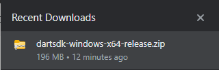
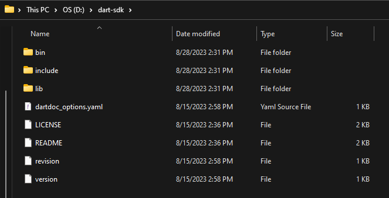
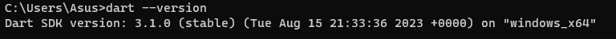
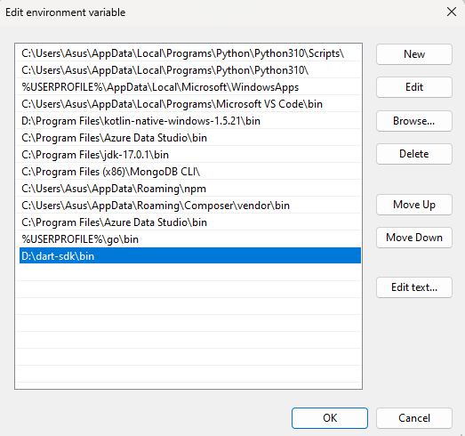
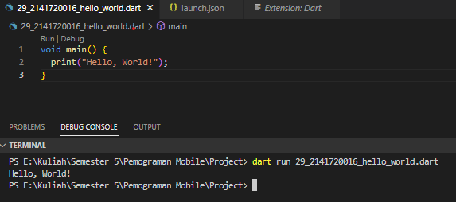

# 2141720016-mobile-2023
## Zahra Annisa Wahono
## 2141720016
## Hello World
Mengistall dan menampilkan "Hello World" menggunakan Dart

1. Mendownload sdk Dart

    

2. Mengekstrak sdk Dart

    

3. Run Dart di CMD

    

4. Menambahkan Path

    

5. Membuat program dan run program

    

