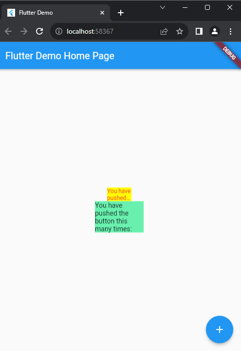

# Laporan Praktikum Pertemuan 10
### Zahra Annisa Wahono
### 2141720016

## Tugas Praktikum



`flutter pub add auto_size_text` digunakan untuk menambahkan plugin ke dalam projek. `pub`singkatan dari pubspec.yaml yang merupakan file konfigurasi.yaml. Nama plugin yang kita tambahkan adalah `auto_size_text`. Setelah menjalankan kode tersebut diterminal, flutter akan menambahakan plugin tersebut ke file `pubspec.yaml` sebagai dependensi. 

### auto_size_text

Plugin `auto_size_text` digunakan untuk engatur ukuran font minimum dan maksimum serta perilaku teks saat ukuran kontainer berubah dan memastikan text tidak terpotong. Berikut merupakan parameter-parameter yang ada pada plugin tersebut

| Parameter | Deskripsi |
|----------|----------|
| key* | Mengontrol bagaimana satu widget menggantikan widget lainnya dalam pohon widget. |
| textKey | Menentukan kunci (key) untuk widget teks yang dihasilkan. Dapat digunakan untuk mengidentifikasi widget tersebut secara unik. | 
| style* | Gaya (style) teks yang akan diterapkan pada teks. Anda dapat mengatur font, warna, dan properti gaya teks lainnya. | 
| minFontSize | Ukuran minimum teks saat teks disesuaikan otomatis. Parameter ini digunakan untuk membatasi seberapa kecil teks dapat diubah ukurannya. |  
| maxFontSize | Ukuran maksimum teks saat teks disesuaikan otomatis. Parameter ini digunakan untuk membatasi seberapa besar teks dapat diubah ukurannya. |  
| stepGranularity |  Langkah (granularitas) dalam penyesuaian ukuran font. Ini mengontrol seberapa halus perubahan ukuran font saat teks disesuaikan.  |
| presetFontSizes |  Menentukan daftar ukuran font yang sudah ditentukan sebelumnya. Parameter ini harus dalam urutan menurun (dari besar ke kecil).  |
| group | Digunakan untuk mengatur beberapa widget AutoSizeText sehingga ukuran font mereka selalu sama. |  
| textAlign* |  Mengatur cara teks diatur secara horizontal, misalnya, rata kiri, rata kanan, atau tengah.  |
| textDirection* |  Menentukan arah teks, yang memengaruhi bagaimana nilai textAlign seperti TextAlign.start dan TextAlign.end diinterpretasikan.  |
| locale* | Digunakan untuk memilih jenis huruf (font) saat karakter Unicode tertentu ditampilkan berbeda tergantung pada lokasi (locale). |  
| softWrap* | Mengatur apakah teks harus mematahkan baris pada pemisah baris yang lembut. |  
| wrapWords | Mengatur apakah kata-kata yang tidak muat dalam satu baris harus dibungkus (wrap). Default-nya adalah true. |  
| overflow* | Cara menangani visual overflow teks jika melebihi batasan area yang tersedia. |  
| overflowReplacement | Jika teks melewati batasan dan tidak muat, widget ini akan ditampilkan sebagai pengganti. |  
| textScaleFactor* | Jumlah piksel font per piksel logis. Juga memengaruhi minFontSize, maxFontSize, dan presetFontSizes. |  
| maxLines | Jumlah maksimum baris yang akan ditampilkan oleh teks. |  
| semanticsLabel* |  Label semantik alternatif untuk teks ini yang digunakan untuk aksesibilitas.  |  

### Widget RedTextWidget

```
import 'package:auto_size_text/auto_size_text.dart';
import 'package:flutter/material.dart';

class RedTextWidget extends StatelessWidget {
  final String text;

const RedTextWidget({Key? key, required this.text}) : super(key: key);

  @override
  Widget build(BuildContext context) {
    return AutoSizeText(
      text,
      style: const TextStyle(color: Colors.red, fontSize: 14),
      maxLines: 2,
      overflow: TextOverflow.ellipsis,
    );
  }
}
```

Pada widget RedTextWidget memiliki satu parameter yaitu `text` yang harus didefinisinikan saat pemanggilan widget tersebut. Kenapa ditambahkan parameter? Agar widget bisa digunakan berkali-kali dengan teks yang berbeda sesuai kebutuhan aplikasinya. Widget tersebut memanfaatkan plugin dengan nama widget `AutoSizeText()`

### main.dart
```
import 'package:flutter/material.dart';
import 'package:flutter_plugin_pubdev/red_text_widget.dart';

void main() => runApp(MyApp());

class MyApp extends StatelessWidget {
  @override
  Widget build(BuildContext context) {
    return MaterialApp(
      title: 'Flutter Demo',
      theme: ThemeData(
        primarySwatch: Colors.blue,
      ),
      home: MyHomePage(title: 'Flutter Demo Home Page'),
    );
  }
}

class MyHomePage extends StatefulWidget {
  MyHomePage({Key? key, required this.title}) : super(key: key);
  final String title;

  @override
  _MyHomePageState createState() => _MyHomePageState();
}

class _MyHomePageState extends State<MyHomePage> {
  int _counter = 0;

  void _incrementCounter() {
    setState(() {
      _counter++;
    });
  }

  @override
  Widget build(BuildContext context) {
    return Scaffold(
      appBar: AppBar(
        title: Text(widget.title),
      ),
      body: Center(
        child: Column(
          mainAxisAlignment: MainAxisAlignment.center,
          children: <Widget>[
            Container(
              color: Colors.yellowAccent,
              width: 50,
              child: const RedTextWidget(
                text: 'You have pushed the button this many times:',
              ),
            ),
            Container(
              color: Colors.greenAccent,
              width: 100,
              child: const Text(
                'You have pushed the button this many times:',
              ),
            ),
          ],
        ),
      ),
      floatingActionButton: FloatingActionButton(
        onPressed: _incrementCounter,
        tooltip: 'Increment',
        child: Icon(Icons.add),
      ), 
    );
  }
}

```

### Implementasi Widget RedTextWidget
```
Container(
    color: Colors.yellowAccent,
    width: 50,
    child: const RedTextWidget(
        text: 'You have pushed the button this many times:',
    ),
),
Container(
    color: Colors.greenAccent,
    width: 100,
    child: const Text(
        'You have pushed the button this many times:',
    )
)
```

Kode diatas memperlihatkan bagaimana penggunaan widget yang telah dibuat sebelumnya dan memberikan perbedaan dengan tanpa pemanfaatan widget tersebut. Pada container pertama menggunakan widget RedTextWidget sedangkan container kedua tidak. Terlihat perbedaan ukuran font dan warna font dari kedua container tersebut. Ukuran font pada container pertama memenuhi ukuran container sedangkan pada container kedua terlihat text tidak memenuhi bagian kontainer bagian kanan.
