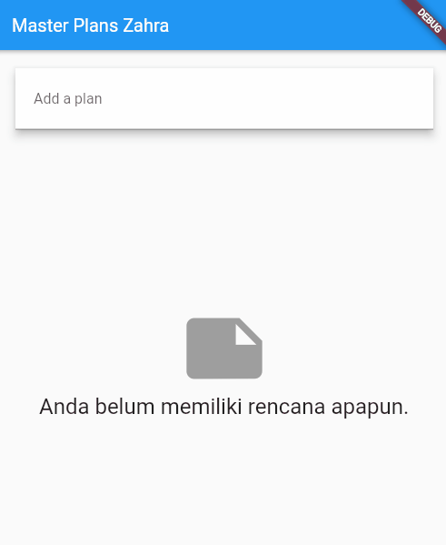

# **Tugas Praktikum 1 - Dasar State dengan Model-View**

  

**Langkah 4: Buat file data_layer.dart**

```
export 'plan.dart';
export 'task.dart';
```

Langkah diatas merupakan pembuatan file data_layer dart yang berisi export dari model-model yang telah dibuat (plan.dart dan task.dart)

Langkah ini dilakukan agar mempermudah proses impor model-model yang telah kita buat. Jadi kita cukup mengimpor satu file 'data_layer.dart' jika kita perlu membutuhkan model yang ada tanpa harus melakukan import model satu persatu. Ini membuat kode menjadi lebih ringkas dan mudah dipelihara karena memungkinkan kita untuk fokus tanpa memikirkan detail model yang ada.


**Langkah 6: buat plan_screen.dart**

```
import '../models/data_layer.dart';
import 'package:flutter/material.dart';

class PlanScreen extends StatefulWidget {
  const PlanScreen({super.key});

  @override
  State createState() => _PlanScreenState();
}

class _PlanScreenState extends State<PlanScreen> {
  Plan plan = const Plan();

  @override
  Widget build(BuildContext context) {
   return Scaffold(
    // ganti ‘Namaku' dengan Nama panggilan Anda
    appBar: AppBar(title: const Text('Master Plan Namaku')),
    body: _buildList(),
    floatingActionButton: _buildAddTaskButton(),
   );
  }
}
```
Pada langkah 6 variabel plan digunakan untuk menyimpan data terkait rencana yang akan ditampilkan. Variable ini akan menyimpan seluruh task yang kita tambahkan dalam bentuk list, dengan adanya variabel ini kita dapat menyimpan, mengubah dan menampilkan task dengan lebih jelas dan efisien. Tanpa variabel ini, kita akan lebih sulit untuk mengupdate atau melihat perubahan yang telah kita lakukan seperti menambahkan dan menghapus task serta mengubah task yang sudah ada.


**Langkah 9: buat widget _buildTaskTile**

Dari langkah 8, kita butuh ListTile untuk menampilkan setiap nilai dari plan.tasks. Kita buat dinamis untuk setiap index data, sehingga membuat view menjadi lebih mudah. Tambahkan kode berikut ini.
```
 Widget _buildTaskTile(Task task, int index) {
    return ListTile(
      leading: Checkbox(
          value: task.complete,
          onChanged: (selected) {
            setState(() {
              plan = Plan(
                name: plan.name,
                tasks: List<Task>.from(plan.tasks)
                  ..[index] = Task(
                    description: task.description,
                    complete: selected ?? false,
                  ),
              );
            });
          }),
      title: TextFormField(
        initialValue: task.description,
        onChanged: (text) {
          setState(() {
            plan = Plan(
              name: plan.name,
              tasks: List<Task>.from(plan.tasks)
                ..[index] = Task(
                  description: text,
                  complete: task.complete,
                ),
            );
          });
        },
      ),
    );
  }

 ``` 

 

Langkah 9 ini menunjukkan pembuatan fungsi _buildTaskTile digunakan untuk membuat tampilan dinamis untuk setiap tugas dalam plan.tasks. Ini memperlihatkan kotak centang untuk status tugas (selesai/belum selesai) dan kotak teks untuk mengedit deskripsi tugas. Ketika ada perubahan pada salah satu dari itu, setState dipanggil untuk memperbarui plan dengan perubahan yang dilakukan pada tugas tertentu. Ini memungkinkan pengguna untuk mengubah dan menyimpan perubahan langsung dari antarmuka pengguna.

**Langkah 11: Tambah Scroll Listener**

Tambahkan method initState() setelah deklarasi variabel scrollController seperti kode berikut.
```
@override
void initState() {
  super.initState();
  scrollController = ScrollController()
    ..addListener(() {
      FocusScope.of(context).requestFocus(FocusNode());
    });
}
```

**Langkah 13: Terakhir, tambah method dispose()**
Terakhir, tambahkan method dispose() berguna ketika widget sudah tidak digunakan lagi.
```
@override
void dispose() {
  scrollController.dispose();
  super.dispose();
}
```
initState() digunakan untuk inisialisasi, disini digunakan untuk mengatur perilaku scrollController saat widget pertama kali dibuat.

dispose() dipanggil saat widget tidak diperlukan lagi, digunakan untuk membersihkan sumber daya yang tidak diperlukan, seperti dalam kasus ini, membersihkan scrollController.

Kedua method ini, baik initState() maupun dispose(), adalah bagian dari siklus hidup widget dalam Flutter yang membantu dalam persiapan dan membersihkan sumber daya yang diperlukan seiring dengan perubahan status dan penggunaan widget. Ini memastikan pengelolaan memori dan sumber daya yang efisien selama aplikasi berjalan.

# **Tugas Praktikum 2: InheritedWidget**

 

**Langkah 1: Buat file plan_provider.dart**

Buat folder baru provider di dalam folder lib, lalu buat file baru dengan nama plan_provider.dart berisi kode seperti berikut.

```
import 'package:flutter/material.dart';
import '../models/data_layer.dart';

class PlanProvider extends InheritedNotifier<ValueNotifier<Plan>> {
  const PlanProvider({super.key, required Widget child, required
   ValueNotifier<Plan> notifier})
  : super(child: child, notifier: notifier);

  static ValueNotifier<Plan> of(BuildContext context) {
   return context.
    dependOnInheritedWidgetOfExactType<PlanProvider>()!.notifier!;
  }
}

```

Pada langkah 1, "InheritedWidget" digunakan sebagai superclass dari "PlanProvider". InheritedWidget adalah bagian dari Flutter yang memungkinkan data untuk diwariskan ke widget di dalam pohon widget tanpa perlu melewati data secara langsung melalui konstruktor widget. Ini berguna dalam situasi di mana beberapa widget di dalam subtree perlu mengakses data yang sama.

Di dalam kode yang diberikan, "PlanProvider" mewarisi "InheritedNotifier" yang pada dasarnya adalah turunan dari "InheritedWidget". "InheritedNotifier" adalah variasi dari "InheritedWidget" yang berisi Notifier (dalam hal ini, "ValueNotifier<Plan>"). Notifier ini digunakan untuk memberitahukan widget-widget yang menggunakan "PlanProvider" tentang perubahan pada objek "Plan".

Dalam hal ini, "ValueNotifier" digunakan karena ia adalah jenis notifikasi yang dapat memberitahukan widget-widget yang menggunakan "PlanProvider" ketika terjadi perubahan pada objek "Plan". Saat terjadi perubahan pada nilai "Plan", "ValueNotifier" akan memberi tahu semua widget yang bergantung pada data tersebut sehingga mereka dapat memperbarui tampilan mereka.

Dengan struktur tersebut, widget-widget di bawah subtree "PlanProvider" akan dapat mengakses nilai "Plan" tanpa perlu memasukkannya secara langsung ke setiap widget yang membutuhkannya. Mereka cukup menggunakan method static "of" yang didefinisikan dalam "PlanProvider" untuk mengakses notifikasi perubahan pada "Plan".

**Langkah 3: Tambah method pada model plan.dart**

Tambahkan dua method di dalam model class Plan seperti kode berikut.
```
int get completedCount => tasks
  .where((task) => task.complete)
  .length;

String get completenessMessage =>
  '$completedCount out of ${tasks.length} task
```
Langkah 3 menambahkan dua metode ke dalam kelas model Plan:

`completedCount`: Menghitung berapa banyak tugas yang sudah diselesaikan dari daftar tugas.

`completenessMessage`: Memberikan pesan yang menunjukkan jumlah tugas yang sudah diselesaikan dari total tugas yang ada.

Kedua metode ini memberikan informasi tentang kemajuan tugas, memudahkan untuk melacak seberapa banyak yang sudah selesai dari total tugas yang ada.


Pesan progres yang ditempatkan di bagian bawah layar akan menunjukkan informasi mengenai progres tugas dalam bentuk "0 out of 1 tasks" (dengan nilai yang disesuaikan sesuai dengan tugas yang telah diselesaikan dan total tugas yang ada). Hal ini memudahkan pengguna untuk melihat seberapa banyak tugas yang telah diselesaikan dari total tugas yang ada dalam aplikasi Master Plan.


# **Tugas Praktikum 3: State di Multiple Screens**




 Aplikasi memiliki dua layar utama, satu untuk membuat rencana (PlanCreatorScreen) dan yang lainnya untuk melihat rencana (PlanScreen).

Bagian kiri diagram, dimulai dari "MaterialApp", menunjukkan bagaimana sistem bergerak dari layar pembuat rencana ("PlanCreatorScreen") dengan berbagai elemen seperti "Column", "TextField", dan "ListView". Bagian kanan diagram, dimulai dari "MaterialApp" juga, menunjukkan struktur layar untuk melihat rencana ("PlanScreen") dengan komponen-komponen seperti "Scaffold", "Column", "Expanded", "SafeArea", "ListView", dan "Text".


