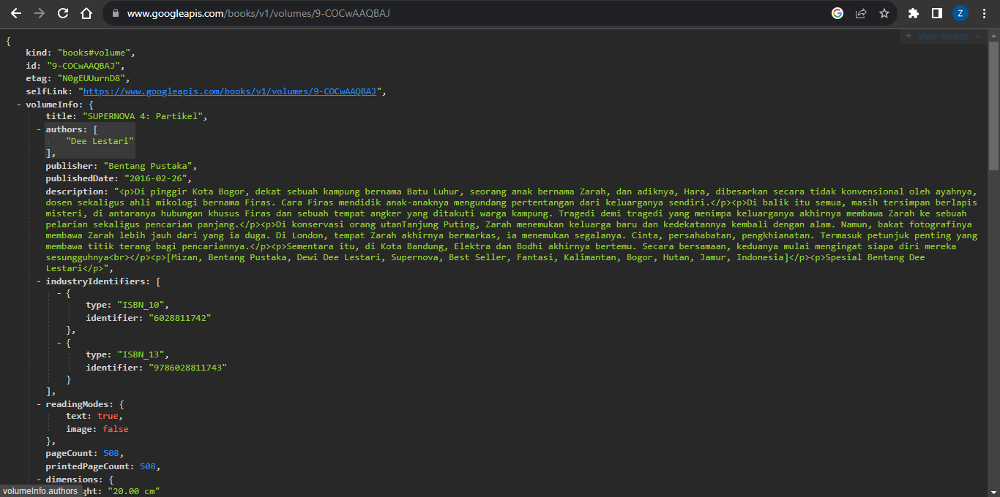
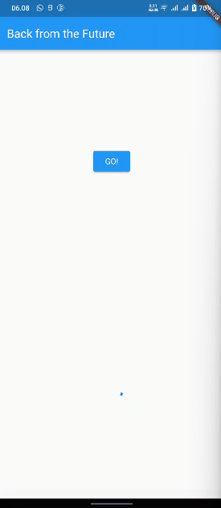

> **Zahra Annisa Wahono**
>
> 2141720016
>
> 3H/29
---
# **Praktikum 1: Mengunduh Data dari Web Service (API)**

**Soal 1**
Tambahkan nama panggilan Anda pada title app sebagai identitas hasil pekerjaan Anda.
```
return Scaffold(
      appBar: AppBar(
        title: const Text('Back from the Future - Zahra'),
      ),
```

**Soal 2** Carilah judul buku favorit Anda di Google Books, lalu ganti ID buku pada variabel `path`
```
  Future<Response> getData() async{
    const authority = 'www.googleapis.com';
    const path = '/books/v1/volumes/9-COCwAAQBAJ';
    Uri url = Uri.https(authority, path);
    return http.get(url);
  }
  ```


**Soal 3** Jelaskan maksud kode langkah 5 tersebut terkait substring dan catchError!
```
            onPressed: () {
                setState(() {});
                getData()
                .then((value){
                  result = value.body.toString().substring(0,450);
                  setState(() {
                    
                  });
                }).catchError((_){
                  result = 'An error has occured';
                  setState(() {
                    
                  });
                });
              },
```

Pada langkah kelima, dilakukan penggunaan metode substring(0, 450) untuk mengekstraksi 450 karakter pertama dari respons HTTP untuk membatasi panjang teks yang akan ditampilkan dalam aplikasi. Penggunaan catchErrordigunakan untuk mengatasi kemungkinan terjadinya kesalahan selama proses permintaan data. Jika terdapat kesalahan saat pengambilan data, maka  pesan 'An error has occurred' akan dimasukkan ke variabel result dan ditampilkan.



# **Praktikum 2: Menggunakan await/async untuk menghindari callbacks**

**Soal 4** Jelaskan maksud kode langkah 1 dan 2

Langkah pertama ditambahkan tiga metode asynchronous di dalam class _FuturePageState pada file main.dart. Metode-metode tersebut (returnOneAsync, returnTwoAsync, dan returnThreeAsync) mensimulasikan operasi asynchronous dengan menunggu selama 3 detik menggunakan Future.delayed dan mengembalikan nilai integer setelah itu.

Pada langkah kedua, metode count() ini digunakan untuk menggambarkan penggunaan asynchronous di dalam Flutter, di mana kita menunggu hasil dari beberapa operasi asynchronous dan kemudian melakukan sesuatu (dalam hal ini, mengupdate state widget) ketika semua operasi tersebut selesai.


# **Praktikum 3: Menggunakan Completer di Future**

**Langkah 2: Tambahkan variabel dan method**
Tambahkan variabel late dan method di class _FuturePageState seperti ini.

```
late Completer completer;

Future getNumber() {
  completer = Completer<int>();
  calculate();
  return completer.future;
}

Future calculate() async {
  await Future.delayed(const Duration(seconds : 5));
  completer.complete(42);
}
```
**Soal 5** Jelaskan maksud kode langkah 2 tersebut!

Langkah dua mendefinisikan variabel completer dan dua metode, yaitu getNumber() dan calculate(), dalam class _FuturePageState. completer digunakan sebagai objek Completer, yang memungkinkan pembuatan nilai Future secara manual. Metode getNumber() menginisialisasi completer, memanggil metode calculate() yang mensimulasikan operasi yang memakan waktu, dan mengembalikan completer.future. Dengan ini, saat operasi selesai, completer.complete(42) dipanggil, dan nilai 42 dapat diakses melalui completer.future. Langkah-langkah tersebut menciptakan mekanisme untuk menghasilkan nilai asinkron setelah suatu operasi selesai, dan Completer digunakan untuk mengelola alur eksekusi dan nilai Future.


**Soal 6**
Jelaskan maksud perbedaan kode langkah 2 dengan langkah 5-6 

Langkah 5: Ganti method calculate()
Gantilah isi code method calculate() seperti kode berikut, atau Anda dapat membuat calculate2()
```
calculate() async {
    try {
      await new Future.delayed(const Duration(seconds: 5));
    completer.complete(42);
  
    } catch (e) {
      completer.completeError({});
    } 
  
  }
```
Langkah 6: Pindah ke onPressed()
Ganti menjadi kode seperti berikut.
```
getNumber().then((value) {
  setState(() {
    result = value.toString();
  });
}).catchError((e) {
  result = 'An error occurred';
});
```

Langkah 2, 5, dan 6 berkaitan dengan penanganan operasi asinkron menggunakan Completer dan Future dalam konteks Flutter. Langkah 2 memperkenalkan variabel completer dan dua metode, getNumber() dan calculate(), yang bekerja bersama untuk menghasilkan nilai asinkron. Langkah 5 menggantikan isi metode calculate() dengan penanganan error yang lebih rinci, memungkinkan program untuk menangani dan mengatasi kesalahan yang mungkin terjadi selama eksekusi operasi. Langkah 6 memperbarui bagian onPressed() untuk memanfaatkan hasil dari operasi asinkron, menggunakan .then() untuk menangkap nilai ketika operasi selesai dan .catchError() untuk menangani kesalahan


**Soal 7** Capture hasil praktikum Anda berupa GIF


