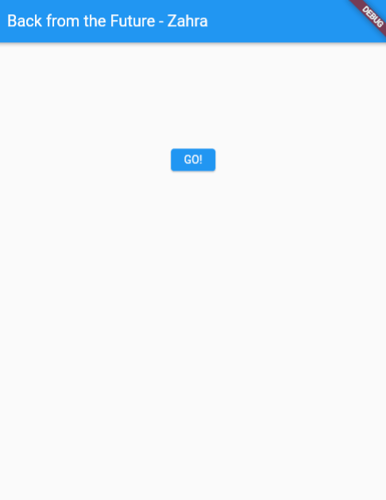
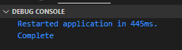
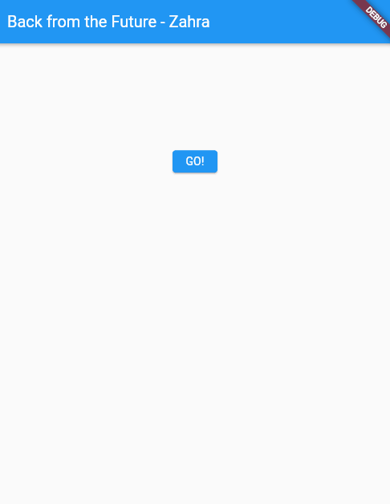
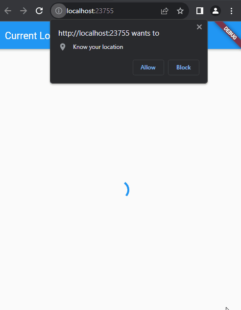
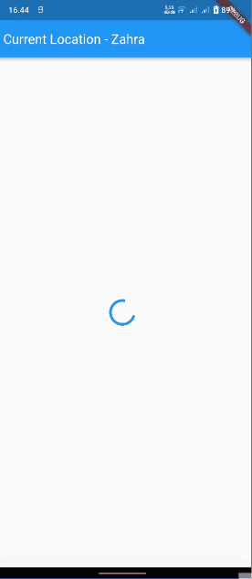

> **Zahra Annisa Wahono**
>
> 2141720016
>
> 3H/29
---
# **Praktikum 1: Mengunduh Data dari Web Service (API)**

**Soal 1**
Tambahkan nama panggilan Anda pada title app sebagai identitas hasil pekerjaan Anda.
```
return Scaffold(
      appBar: AppBar(
        title: const Text('Back from the Future - Zahra'),
      ),
```

**Soal 2** Carilah judul buku favorit Anda di Google Books, lalu ganti ID buku pada variabel `path`
```
  Future<Response> getData() async{
    const authority = 'www.googleapis.com';
    const path = '/books/v1/volumes/9-COCwAAQBAJ';
    Uri url = Uri.https(authority, path);
    return http.get(url);
  }
  ```


**Soal 3** Jelaskan maksud kode langkah 5 tersebut terkait substring dan catchError!
```
            onPressed: () {
                setState(() {});
                getData()
                .then((value){
                  result = value.body.toString().substring(0,450);
                  setState(() {
                    
                  });
                }).catchError((_){
                  result = 'An error has occured';
                  setState(() {
                    
                  });
                });
              },
```

Pada langkah kelima, dilakukan penggunaan metode substring(0, 450) untuk mengekstraksi 450 karakter pertama dari respons HTTP untuk membatasi panjang teks yang akan ditampilkan dalam aplikasi. Penggunaan catchErrordigunakan untuk mengatasi kemungkinan terjadinya kesalahan selama proses permintaan data. Jika terdapat kesalahan saat pengambilan data, maka  pesan 'An error has occurred' akan dimasukkan ke variabel result dan ditampilkan.


# **Praktikum 2: Menggunakan await/async untuk menghindari callbacks**

**Soal 4** Jelaskan maksud kode langkah 1 dan 2

Langkah pertama ditambahkan tiga metode asynchronous di dalam class _FuturePageState pada file main.dart. Metode-metode tersebut (returnOneAsync, returnTwoAsync, dan returnThreeAsync) mensimulasikan operasi asynchronous dengan menunggu selama 3 detik menggunakan Future.delayed dan mengembalikan nilai integer setelah itu.

Pada langkah kedua, metode count() ini digunakan untuk menggambarkan penggunaan asynchronous di dalam Flutter, di mana kita menunggu hasil dari beberapa operasi asynchronous dan kemudian melakukan sesuatu (dalam hal ini, mengupdate state widget) ketika semua operasi tersebut selesai.


# **Praktikum 3: Menggunakan Completer di Future**

**Langkah 2: Tambahkan variabel dan method**
Tambahkan variabel late dan method di class _FuturePageState seperti ini.

```
late Completer completer;

Future getNumber() {
  completer = Completer<int>();
  calculate();
  return completer.future;
}

Future calculate() async {
  await Future.delayed(const Duration(seconds : 5));
  completer.complete(42);
}
```
**Soal 5** Jelaskan maksud kode langkah 2 tersebut!

Langkah dua mendefinisikan variabel completer dan dua metode, yaitu getNumber() dan calculate(), dalam class _FuturePageState. completer digunakan sebagai objek Completer, yang memungkinkan pembuatan nilai Future secara manual. Metode getNumber() menginisialisasi completer, memanggil metode calculate() yang mensimulasikan operasi yang memakan waktu, dan mengembalikan completer.future. Dengan ini, saat operasi selesai, completer.complete(42) dipanggil, dan nilai 42 dapat diakses melalui completer.future. Langkah-langkah tersebut menciptakan mekanisme untuk menghasilkan nilai asinkron setelah suatu operasi selesai, dan Completer digunakan untuk mengelola alur eksekusi dan nilai Future.


**Soal 6**
Jelaskan maksud perbedaan kode langkah 2 dengan langkah 5-6 

Langkah 5: Ganti method calculate()
Gantilah isi code method calculate() seperti kode berikut, atau Anda dapat membuat calculate2()
```
calculate() async {
    try {
      await new Future.delayed(const Duration(seconds: 5));
    completer.complete(42);
  
    } catch (e) {
      completer.completeError({});
    } 
  
  }
```
Langkah 6: Pindah ke onPressed()
Ganti menjadi kode seperti berikut.
```
getNumber().then((value) {
  setState(() {
    result = value.toString();
  });
}).catchError((e) {
  result = 'An error occurred';
});
```

Langkah 2, 5, dan 6 berkaitan dengan penanganan operasi asinkron menggunakan Completer dan Future dalam konteks Flutter. Langkah 2 memperkenalkan variabel completer dan dua metode, getNumber() dan calculate(), yang bekerja bersama untuk menghasilkan nilai asinkron. Langkah 5 menggantikan isi metode calculate() dengan penanganan error yang lebih rinci, memungkinkan program untuk menangani dan mengatasi kesalahan yang mungkin terjadi selama eksekusi operasi. Langkah 6 memperbarui bagian onPressed() untuk memanfaatkan hasil dari operasi asinkron, menggunakan .then() untuk menangkap nilai ketika operasi selesai dan .catchError() untuk menangani kesalahan


**Soal 7** Capture hasil praktikum Anda berupa GIF


**Soal 8** Jelaskan maksud perbedaan kode langkah 1 dan 4!

Langkah 1 menggunakan pendekatan FutureGroup untuk menangani sejumlah future secara bersamaan. Dalam kasus ini, tiga fungsi asinkron (returnOneAsync(), returnTwoAsync(), dan returnThreeAsync()) ditambahkan ke dalam FutureGroup, dan kemudian futureGroup.close() digunakan untuk menutup grup tersebut. Metode then pada futureGroup.future kemudian digunakan untuk menangani hasilnya ketika semua future selesai dieksekusi, menjumlahkan nilai-nilai yang dihasilkan dan memperbarui state widget.

Sementara itu, langkah 4 menggunakan pendekatan Future.wait, yang menyederhanakan proses menunggu sejumlah future menjadi satu future tunggal (futures). Dalam hal ini, kode membuat List dari future-future yang diberikan dan menunggu sampai semua future tersebut selesai. Ketika semuanya selesai, nilai-nilai hasilnya dikumpulkan dalam bentuk List dan diakses melalui then. Meskipun pendekatan ini lebih ringkas, keduanya pada dasarnya mencapai tujuan yang sama: menangani sejumlah future secara bersamaan dan menanggapi hasilnya setelah semuanya selesai dieksekusi.

# **Praktikum 5: Menangani Respon Error pada Async Code**

**Soal 9** Capture hasil praktikum






**Soal 10** Panggil method handleError() tersebut di ElevatedButton, lalu run. Apa hasilnya? Jelaskan perbedaan kode langkah 1 dan 4!


```
Future returnError() async {
    await Future.delayed(const Duration(seconds: 2));
    throw Exception('Something terrible happened!');
  }
```

```
  Future handleError() async{
    try{
      await returnError();
    }catch(error){
      setState(() {
        result = error.toString();
      });
    }
    finally{
      print('Complete');
    }
  }
```
Metode returnError() berfungsi sebagai future yang secara sengaja memicu kesalahan setelah menunggu selama 2 detik sebagai bagian dari simulasi operasi. Sebaliknya, metode handleError() berusaha mengeksekusi returnError() dalam blok try-catch; jika returnError() menghasilkan kesalahan, blok catch akan menangkapnya dan memperbarui state widget dengan pesan kesalahan. Blok finally pada handleError() selalu dijalankan setelah blok try atau catch, independen dari terjadinya kesalahan. Dengan demikian, tujuan dari returnError() adalah menyimulasikan kondisi kesalahan, sedangkan handleError() lebih berfokus pada penanganan kesalahan yang mungkin terjadi dan pelaksanaan tindakan tertentu setelah operasi selesai.

# **Praktikum 6: Menggunakan Future dengan StatefulWidget**

**Soal 11** Tambahkan nama panggilan Anda pada tiap properti title
```
 @override
  Widget build(BuildContext context) {
    return  Scaffold(
      appBar: AppBar(
        title: Text('Current Location - Zahra'),
      ),
      body: Center(
        child: Text(myPosition),
      ),
    );
  }
  ```


**Soal 12** Apakah Anda mendapatkan koordinat GPS ketika run di browser? Mengapa demikian?



Bisa, karena saya menggunakan dependensi geolocator : ^10.1 yang secara otomatis akan menambahkan paket geolocator_web yang mendukung geolokasi di browser




# **Praktikum 7: Manajemen Future dengan FutureBuilder**


**Soal 13** Apakah ada perbedaan UI dengan praktikum sebelumnya? Mengapa demikian?

Penggunaan FutureBuilder membantu menyederhanakan dan membersihkan kode, terutama ketika bekerja dengan operasi asinkron. Ini membantu meningkatkan keterbacaan kode, mengurangi boilerplate, dan menyediakan cara yang lebih terstruktur untuk menangani state dan kondisi UI

**Soal 14** Apakah ada perbedaan UI dengan langkah sebelumnya? Mengapa demikian?


Tidak ada perbedaan dari segi UI namun jika terjadi error saat pengambilan data lokasi, maka akan mucul peringatannya

# **Praktikum 8: Navigation route dengan Future Function**

**Soal 15** Tambahkan nama panggilan Anda pada tiap properti title

```
Widget build(BuildContext context) {
    return Scaffold(
      backgroundColor: color,
      appBar: AppBar(
        title: const Text('Navigation First Screen - Zahra'),
      ),
      body: Center(
        child: ElevatedButton(
            child: const Text('Change Color'),
            onPressed: () {
              _navigateAndGetColor(context);
            }),
      ),
    );
  }
```
**Soal 16** Cobalah klik setiap button, apa yang terjadi ? Mengapa demikian ? Gantilah 3 warna pada langkah 5 dengan warna favorit Anda!


Setelah me ngeklik Change Color maka kita diarahkan ke NavigationSecond. Setiap kali tombol di layar NavigationSecond, variabel color diatur sesuai dengan warna yang sesuai dengan tombol yang diklik . Setelah itu, menggunakan Navigator.pop(context, color), warna tersebut dikirim kembali ke layar NavigationFirst.

Ketika kita kembali ke NavigationFirst, warna yang dikirim kembali digunakan untuk mengatur warna latar belakang layar (backgroundColor: color). 


# **Praktikum 9: Memanfaatkan async/await dengan Widget Dialog**

**Soal 17** Cobalah klik setiap button, apa yang terjadi ? Mengapa demikian ? Gantilah 3 warna pada langkah 3 dengan warna favorit Anda!

Ketika kita klik tombol "Change Color" di layar NavigationDialogScreen, dialog muncul meminta kita untuk memilih warna. Setelah memilih warna dan menutup dialog, warna latar belakang layar seharusnya berubah, tapi pada kode yang diberikan, pembaruan warna tidak terjadi karena dalam fungsi _showColordialog, pemanggilan setState menggunakan nilai yang sama seperti sebelumnya (color = color). Untuk memperbaikinya, kita perlu menyimpan nilai warna yang dipilih dari dialog dan menggunakan nilai itu dalam pemanggilan setState untuk memastikan pembaruan warna yang benar setelah memilih warna dari dialog.

