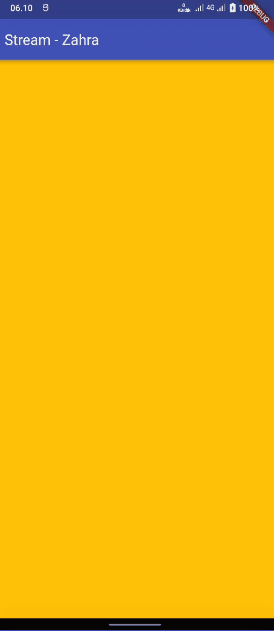

**Zahra Annisa Wahono**

**3H/29**

**2141720016**
---

# **Lanjutan State Management dengan Streams**

## **Praktikum 1: Dart Streams**

**Soal 1:** Tambahkan nama panggilan Anda pada title app sebagai identitas hasil pekerjaan Anda. Gantilah warna tema aplikasi sesuai kesukaan Anda.
```
class MyApp extends StatelessWidget {
  const MyApp({super.key});

  // This widget is the root of your application.
  @override
  Widget build(BuildContext context) {
    return MaterialApp(
      title: 'Stream - Zahra',
      theme: ThemeData(
        primarySwatch: Colors.indigo
      ),
      home: const StreamHomePage(),
    );
  }
}
```
**Soal 2:** Tambahkan 5 warna lainnya sesuai keinginan Anda pada variabel colors tersebut.

```
import 'package:flutter/material.dart';

class ColorStream {
  final List<Color> colors = [
    Colors.blueGrey,
    Colors.amber,
    Colors.deepPurple,
    Colors.lightBlue,
    Colors.teal,
    Colors.black,
    Colors.lime,
    Colors.pink,
    Colors.grey,
    Colors.brown,
  ];
}
```

**Soal 3:** Jelaskan fungsi keyword yield* pada kode tersebut!
Apa maksud isi perintah kode tersebut?
```
Stream<Color> getColors() async* {
    yield* Stream.periodic(const Duration(seconds: 1), (int t) {
      int index = t % colors.length;
      return colors[index];
    });
  }

```
Kode tersebut menggunakan keyword yield* dalam Dart untuk membuat sebuah stream yang menghasilkan nilai berulang setiap detik. Fungsi generator menggunakan Stream.periodic untuk menciptakan stream dengan interval waktu satu detik, dan setiap kali dipanggil, mengembalikan nilai dari array colors berdasarkan indeks yang dihitung dengan memanfaatkan waktu atau iterasi stream. Dengan demikian, stream tersebut secara berurutan mengeluarkan warna-warna dari array colors setiap detiknya.

**Soal 4:** Capture hasil praktikum Anda berupa GIF



**Soal 5:**

## **Praktikum 2: Streams Controllers dan Sinks**

**Soal 6:**

**Soal 7:**

## **Praktikum 3: Injeksi Data ke Streams**

**Soal 8:**

## **Praktikum 4: Subscribe ke Strean Events**

**Soal 9:**

## **Praktikum 5: Multiple Stream Subscriptions**

**Soal 10:**

**Soal 11:**

## **Praktikum 6: StreamBuilder**

**Soal 12:**

## **Praktikum 7: BLoC Pattern**

**Soal 13:**
