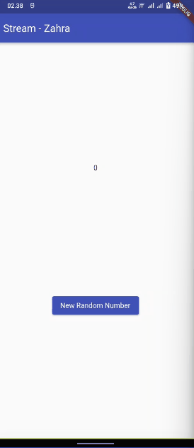
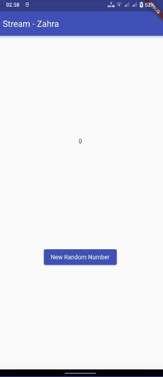
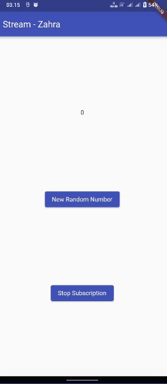
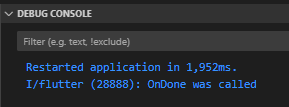

**Zahra Annisa Wahono**

**3H/29**

**2141720016**

---

# **Lanjutan State Management dengan Streams**

## **Praktikum 1: Dart Streams**

**Soal 1:** Tambahkan nama panggilan Anda pada title app sebagai identitas hasil pekerjaan Anda. Gantilah warna tema aplikasi sesuai kesukaan Anda.
```
class MyApp extends StatelessWidget {
  const MyApp({super.key});

  // This widget is the root of your application.
  @override
  Widget build(BuildContext context) {
    return MaterialApp(
      title: 'Stream - Zahra',
      theme: ThemeData(
        primarySwatch: Colors.indigo
      ),
      home: const StreamHomePage(),
    );
  }
}
```
**Soal 2:** Tambahkan 5 warna lainnya sesuai keinginan Anda pada variabel colors tersebut.

```
import 'package:flutter/material.dart';

class ColorStream {
  final List<Color> colors = [
    Colors.blueGrey,
    Colors.amber,
    Colors.deepPurple,
    Colors.lightBlue,
    Colors.teal,
    Colors.black,
    Colors.lime,
    Colors.pink,
    Colors.grey,
    Colors.brown,
  ];
}
```

**Soal 3:** Jelaskan fungsi keyword yield* pada kode tersebut!
Apa maksud isi perintah kode tersebut?
```
Stream<Color> getColors() async* {
    yield* Stream.periodic(const Duration(seconds: 1), (int t) {
      int index = t % colors.length;
      return colors[index];
    });
  }

```
Kode tersebut menggunakan keyword yield* dalam Dart untuk membuat sebuah stream yang menghasilkan nilai berulang setiap detik. Fungsi generator menggunakan Stream.periodic untuk menciptakan stream dengan interval waktu satu detik, dan setiap kali dipanggil, mengembalikan nilai dari array colors berdasarkan indeks yang dihitung dengan memanfaatkan waktu atau iterasi stream. Dengan demikian, stream tersebut secara berurutan mengeluarkan warna-warna dari array colors setiap detiknya.

**Soal 4:** Capture hasil praktikum Anda berupa GIF


**Soal 5:** Jelaskan perbedaan menggunakan listen dan await for (langkah 9) !


Perbedaan antara menggunakan await for dan listen terletak pada sifat blocking dan non-blocking dari keduanya dalam penanganan stream dalam Dart. Penggunaan await for membuat eksekusi metodenya bersifat blocking, di mana kode akan menunggu hingga nilai berikutnya tersedia dalam stream sebelum melanjutkan, sementara listen bersifat non-blocking, memungkinkan eksekusi kode untuk terus berjalan tanpa menunggu nilai stream, dan setiap nilai baru yang tersedia akan memicu pemanggilan fungsi yang diberikan sebagai argumen.

## **Praktikum 2: Streams Controllers dan Sinks**

**Soal 6:** Jelaskan maksud kode langkah 8 dan 10 tersebut!
```
  @override
  void initState(){
    numberStream = NumberStream();
    numberStreamController = numberStream.controller;
    Stream stream = numberStreamController.stream;
    stream.listen((event){
      setState((){
        lastNumber = event;
      });
    });
    super.initState();
  }

  void addRandomNumber(){
    Random random = Random();
    int myNum = random.nextInt(10);
    numberStream.addNumbertoSink(myNum);
  }
```
Dalam langkah awal pembuatan widget, dibuat objek NumberStream dan StreamController, serta ditambahkan pendengar (listener) pada aliran data dari StreamController. Ketika nilai dalam aliran data mengalami perubahan, fungsi setState dipanggil untuk mengupdate nilai lastNumber, yang nantinya akan mengakibatkan perubahan pada tampilan. Fungsi addRandomNumber membuat angka acak dan menyuntikkannya ke dalam aliran data melalui numberStream.addNumbertoSink(myNum).



**Soal 7:** Jelaskan maksud kode langkah 13 sampai 15 


Langkah 13 menambahkan fungsi addError ke dalam file "stream.dart", yang memungkinkan penambahan error ke dalam sink dari StreamController. Langkah 14 memperluas implementasi pendengar aliran data di file "main.dart" dengan menambahkan fungsi onError. Jika terjadi error dalam aliran data, nilai lastNumber akan diperbarui menjadi -1. Langkah 15 mengubah implementasi fungsi addRandomNumber di file "main.dart" dengan menonaktifkan pembuatan angka acak dan menggantinya dengan pemanggilan fungsi addError. Hal ini memberikan kemampuan untuk mensimulasikan dan menangani situasi error dalam aliran data dengan mengubah nilai lastNumber menjadi -1.

## **Praktikum 3: Injeksi Data ke Streams**

**Soal 8:** Jelaskan maksud kode langkah 1-3 tersebut!

Langkah 1 menambahkan variabel transformer ke dalam kelas _StreamHomePageState di file "main.dart". Langkah 2 menciptakan sebuah StreamTransformer dalam metode initState, yang mengatur transformasi data dalam aliran, mengalikan nilai input dengan 10, dan menangani error dengan mengirim nilai -1 ke dalam aliran. Pada langkah 3, metode transform diterapkan pada objek stream, memproses aliran data sesuai dengan transformasi yang telah ditentukan oleh transformer. Hasilnya diteruskan ke listener aliran data, di mana nilai tersebut digunakan untuk memperbarui lastNumber dalam setState.  



## **Praktikum 4: Subscribe ke Strean Events**

**Soal 9:** Jelaskan maksud kode langkah 2, 6 dan 8 tersebut!


Langkah 2 memodifikasi metode initState dalam Flutter. Setelah mendapatkan aliran data dari numberStreamController, sebuah subscription dibuat untuk mendengarkan perubahan pada aliran tersebut. Jika terjadi perubahan, nilai lastNumber diperbarui, sedangkan jika terjadi error, nilai lastNumber diatur menjadi -1. Pada langkah ini juga, pesan 'OnDone was called' akan dicetak ketika aliran data selesai. Langkah 6, yang umumnya terdapat dalam metode dispose, menggunakan subscription.cancel() untuk memastikan bahwa langganan pada aliran data dihentikan ketika widget tidak lagi digunakan. Langkah 8 mengubah metode addRandomNumber, menambahkan pemeriksaan untuk memastikan bahwa angka acak hanya ditambahkan ke aliran data jika numberStreamController belum ditutup. Jika sudah ditutup, nilai lastNumber diatur menjadi -1. 





## **Praktikum 5: Multiple Stream Subscriptions**

**Soal 10:**

**Soal 11:**

## **Praktikum 6: StreamBuilder**

**Soal 12:**

## **Praktikum 7: BLoC Pattern**

**Soal 13:**
