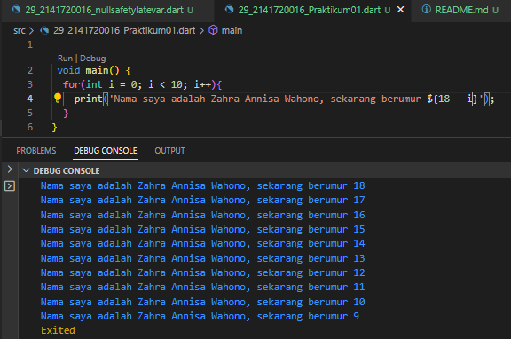

<<<<<<< HEAD
# 2141720016-mobile-2023
=======
# 2141720016-mobile-2023
## Zahra Annisa Wahono
## 2141720016
## Pengantar Bahasa Pemograman Dart
Mengistall dan menampilkan "Hello World" menggunakan Dart

1. Modifikasilah kode pada baris 3 di VS Code atau Editor Code favorit Anda berikut ini agar mendapatkan keluaran (output) sesuai yang diminta!

    

    Karena pada soal ini hanya diperbolehkan mengubah kode dari baris ke 3, maka perulangan akan tetap memiliki i yang terus bertambah (increment). Dari situ kita dapat memanfaatkannya dengan mengoperasikan i sedemikian rupa agar sesui dengan output yang diminta. Umur pada i=0 akan sama dengan 18 dan akan terus berkurang 1 pada setiap perulangannya sedangkan i akan terus bertambah 1. Maka dapat digunakan operasi (18-i)

2. Mengapa sangat penting untuk memahami bahasa pemrograman Dart sebelum kita menggunakan framework Flutter ? Jelaskan!

    **Jawab**:  Karena Flutter dibuat dengan menggunakan bahasa pemograman Dart. Kita akan lebih mudah mempelajari Flutter jika kita telah memahami bahasa pemograman Dart.

3. Rangkumlah materi dari codelab ini menjadi poin-poin penting yang dapat Anda gunakan untuk membantu proses pengembangan aplikasi mobile menggunakan framework Flutter.

    **Jawab**:

    ### Kelebihan Dart
    * Productive tooling 
    * Garbage collection u
    * Type annotations (opsional) 
    * Statically typed
    * Portability

    ### Cara Kerja Dart
    Pengeksekusian kode Dart dapat dilakukan dengan 2 cara :

    * Dart virtual machines (VMs)

    * JavaScript compilations

    Lingkungan yang mendukung bahasa Dart perlu memperhatikan fitur-fitur berikut:
    * Runtime systems
    * Dart core libraries
    * Garbage collectors

    Eksekusi kode Dart dapat beroperasi dalam dua mode :
     * Kompilasi Just-In-Time (JIT)  adalah tempat kode sumber dikompilasi sesuai kebutuhan
     * Kompilasi Ahead-Of-Time (AOT) adalah dimana Dart VM dan kode Anda dikompilasi sebelumnya

    ### Struktur Bahasa Dart
    1. Object orientation

    2. Operators, operator tidak lebih dari method yang didefinisikan dalam class dengan sintaks khusus
    3. Operators

    + (+) untuk tambahan.
    + (-) untuk pengurangan.
    + (*) untuk perkalian.
    + / untuk pembagian.
    + ~/ untuk pembagian bilangan bulat
    + % untuk operasi modulus
    + -expression untuk negasi
    + ++var atau var++ untuk menambah nilai variabel
    + --var atau var-- untuk mengurangi nilai variabel 
    + == untuk memeriksa apakah operan sama
    + != untuk memeriksa apakah operan berbeda
    + (>)  lebih besar dari 
    + < lebih kecil dari 
    + (>=) lebih besar u sama dengan
    + <= kurang dari sama dengan
    + || -> OR
    + && -> AND 

4. Buatlah slide yang berisi penjelasan dan contoh eksekusi kode tentang perbedaan Null Safety dan Late variabel ! (Khusus soal ini kelompok berupa link google slide)

    **Jawab**:

     https://www.canva.com/design/DAFt3qN-Mpk/p7UFG52zy3_Zd6SH-15IdQ/edit?utm_content=DAFt3qN-Mpk&utm_campaign=designshare&utm_medium=link2&utm_source=sharebutton

Referensi:
1. https://bamai.uma.ac.id/2022/09/07/flutter-kelebihan-dan-kekurangannya/
2. https://utter.academy/uploads/lesson_files/2f0c5c74e9488d4c9c734e4264e5869e.pdf
3. https://jti-polinema.github.io/flutter-codelab/06-pengantar-bahasa-pemrograman-dart-bag-1/#5

>>>>>>> 7693b1f (Week 2)
