Zahra Annisa Wahono

TI 3H / 29

# Laporan Praktikum Pertemuan 3

## Praktikum 1: Menerapkan Control Flows ("if/else")

### Langkah 1
Ketik atau salin kode program berikut ke dalam fungsi main().
```
String test = "test2";
if (test == "test1") {
   print("Test1");
} else If (test == "test2") {
   print("Test2");
} Else {
   print("Something else");
}

if (test == "test2") print("Test2 again");
```


### Langkah 2
Silakan coba eksekusi (Run) kode pada langkah 1 tersebut. Apa yang terjadi? Jelaskan!

**Jawab:** 
Terjadi error karena If-Else ditulis dengan huruf awal kapital
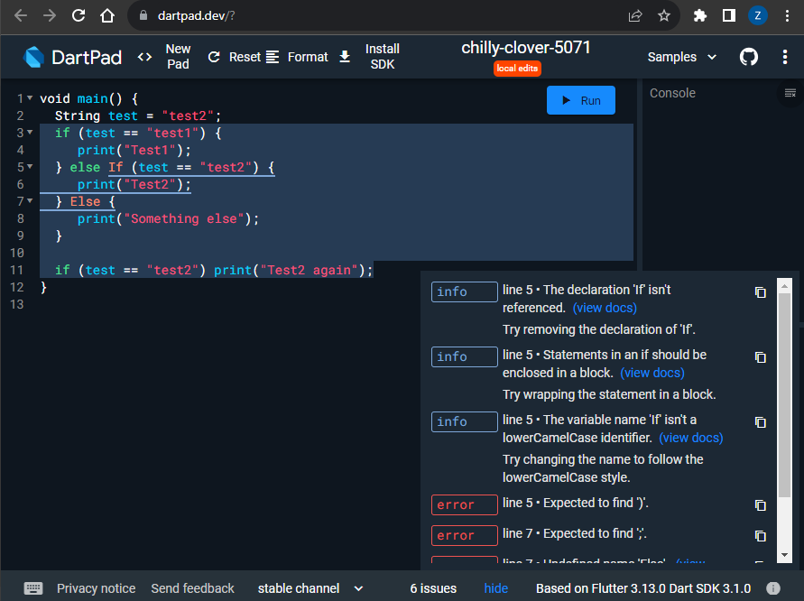
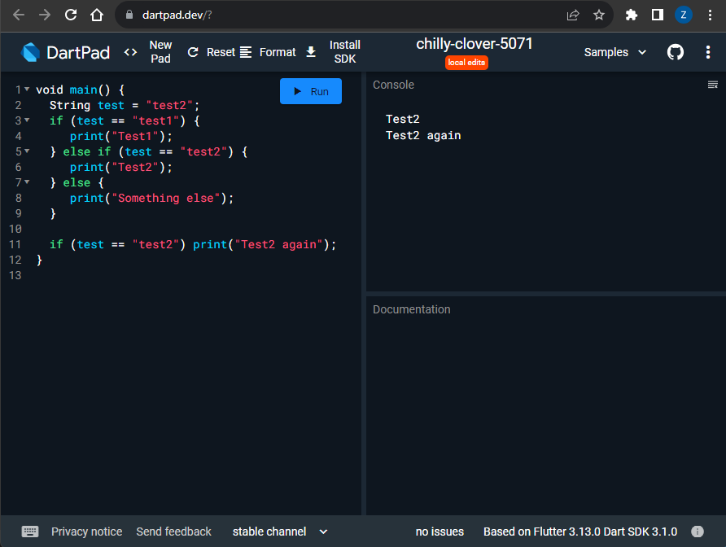
Muncul output berupa tulisan Test2 dan Test2 again karena variabel test berisikan "test2" yang masuk pada perulangan if pertama pada bagian else if yang akan mengeprint "Test2" dan juga perulangan ke dua yang mengeprintkan "Test2 again"

### Langkah 3

Tambahkan kode program berikut, lalu coba eksekusi (Run) kode Anda.

```
String test = "true";
if (test) {
   print("Kebenaran");
}
```

Apa yang terjadi ? Jika terjadi error, silakan perbaiki namun tetap menggunakan if/else.

**Jawab:** Terjadi error karena variable test diisikan dengan tipe string "true" bukan tipe boolean dan tipe data test teelah diinisialisasikan sebelumnya
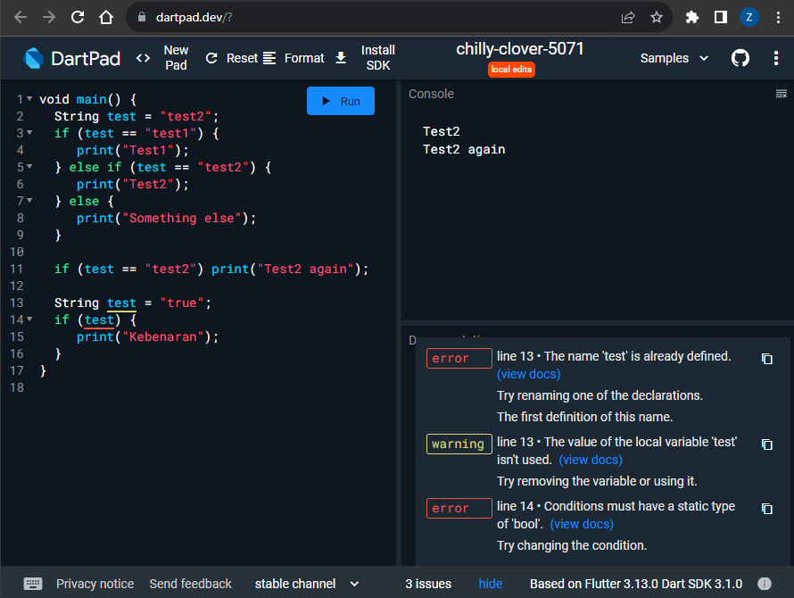
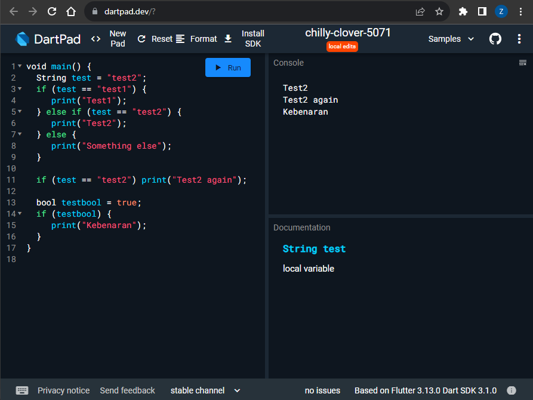

## Praktikum 2: Menerapkan Perulangan "while" dan "do-while"

### Langkah 1

Ketik atau salin kode program berikut ke dalam fungsi main().
```
while (counter < 33) {
  print(counter);
  counter++;
}
```
### Langkah 2

Silakan coba eksekusi (Run) kode pada langkah 1 tersebut. Apa yang terjadi? Jelaskan! Lalu perbaiki jika terjadi error.

**Jawab:**
### Langkah 3
Tambahkan kode program berikut, lalu coba eksekusi (Run) kode Anda.
```
do {
  print(counter);
  counter++;
} while (counter < 77);
```

Apa yang terjadi ? Jika terjadi error, silakan perbaiki namun tetap menggunakan do-while.

**Jawab:** Terjadi error karena variabel counter belum dideklarasi dan diinisialisasikan
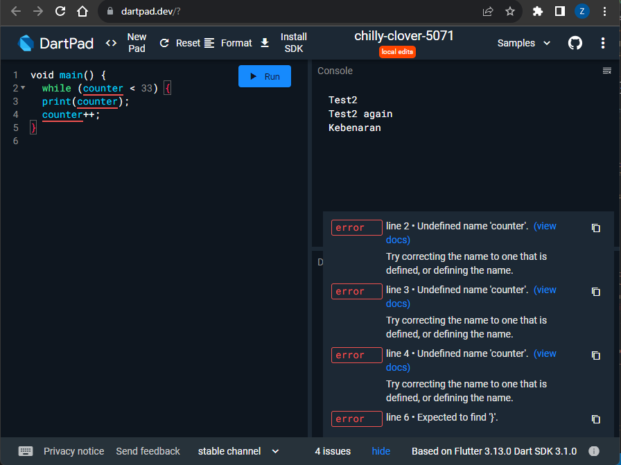
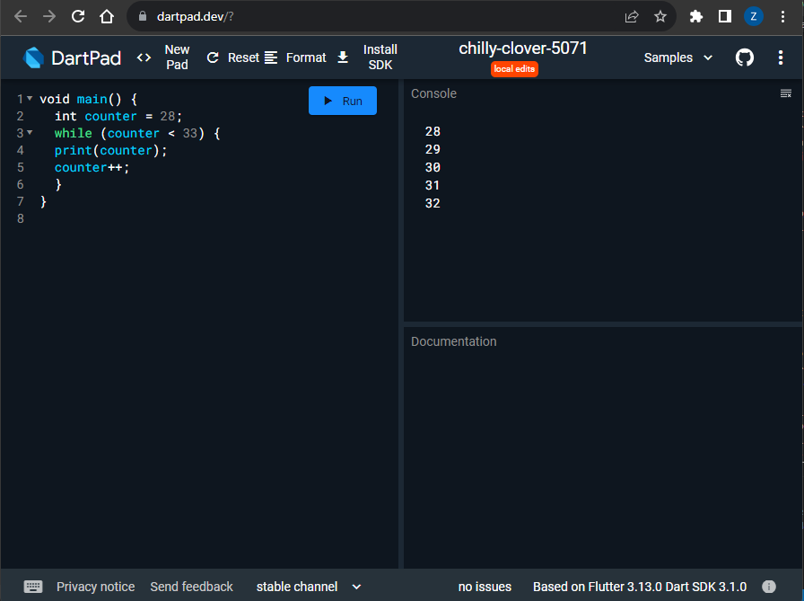


## Praktikum 3: Menerapkan Perulangan "for" dan "break-continue"

### Langkah 1

Ketik atau salin kode program berikut ke dalam fungsi main().
```
for (Index = 10; index < 27; index) {
  print(Index);
}
```
### Langkah 2

Silakan coba eksekusi (Run) kode pada langkah 1 tersebut. Apa yang terjadi? Jelaskan! Lalu perbaiki jika terjadi error.

**Jawab:** Terjadi error karena variabel index belum dideklarasi dan diinisialisasikan dan terdapat penulisan dengan hurup kapital pada variabel index serta tidak terdapat operasi apapun pada modify
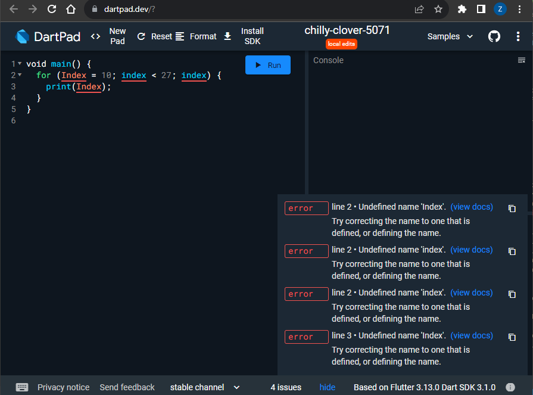
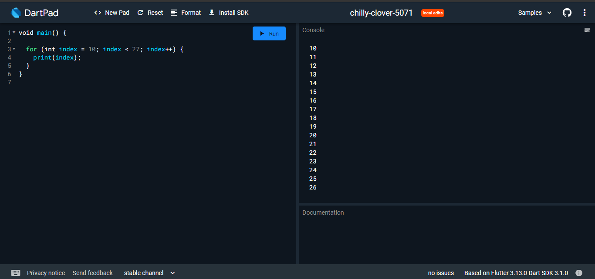

### Langkah 3
Tambahkan kode program berikut di dalam for-loop, lalu coba eksekusi (Run) kode Anda.
```
If (Index == 21) break;
Else If (index > 1 || index < 7) continue;
print(index);
```

Apa yang terjadi ? Jika terjadi error, silakan perbaiki namun tetap menggunakan for dan break-continue.

 **Jawab:** Terjadi erroe karena penggunaan huruf kapital pada if else dan nama variable
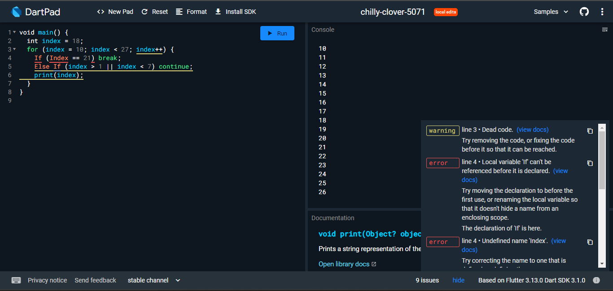
Tidak ada hasil yang muncul karena batasan pada else if index > 1 akan diskip atau continue maka perintah print akan terus diskip atau dilewati
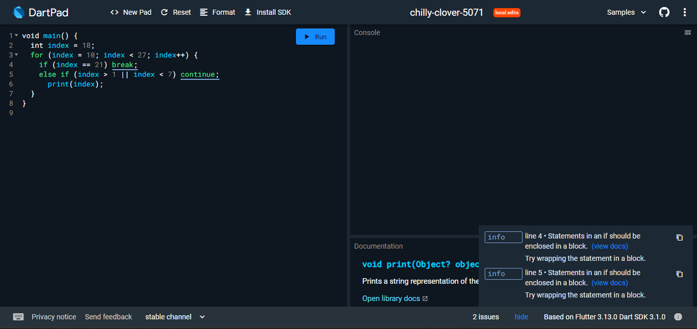
Disini batasan dirubah agar lebih jelas
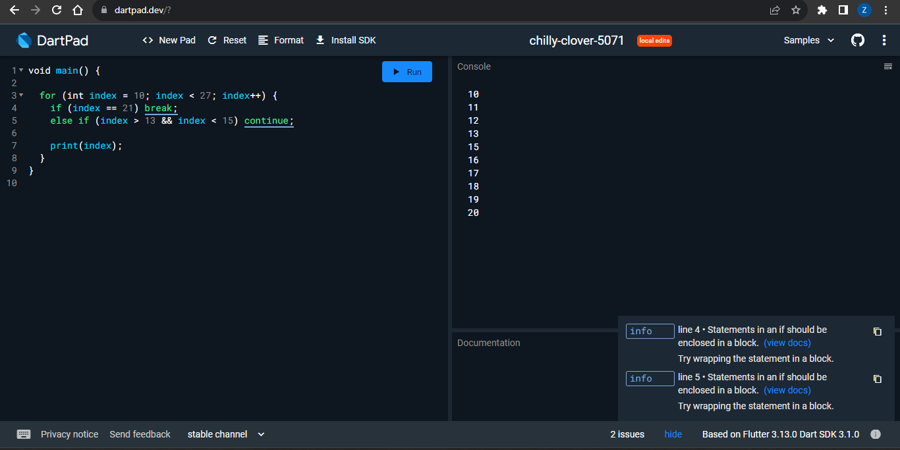

## Tugas Praktikum
Buatlah sebuah program yang dapat menampilkan bilangan prima dari angka 0 sampai 201 menggunakan Dart. Ketika bilangan prima ditemukan, maka tampilkan nama lengkap dan NIM Anda.

**Kode:**
```
List<int> sieveAlgoritm(int n) {
  List<bool> isPrime = List<bool>.filled(n + 1, true);
  List<int> primes = [];

  for (int p = 2; p * p <= n; p++) {
    if (isPrime[p]) {
      for (int i = p * p; i <= n; i += p) {
        isPrime[i] = false;
      }
    }
  }

  for (int i = 2; i <= n; i++) {
    if (isPrime[i]) {
      primes.add(i);
    }
  }

  return primes;
}

void main() {
  int n = 201; 
  String nama = "Zahra Annisa Wahono";
  String nim = "2141720016";
  List<int> primeNumbers = sieveAlgoritm(n);

  print("Bilangan prima dari 2 hingga $n adalah:");
  print(primeNumbers);
  print("Nama : $nama");
  print("NIM : $nim");
}

```

**Output:**
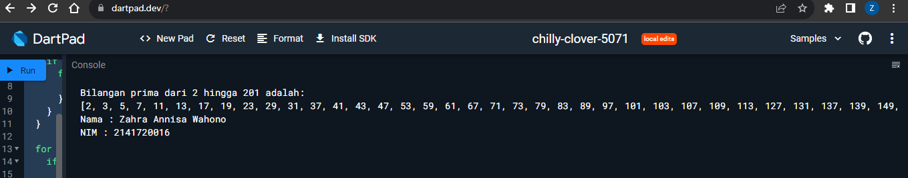
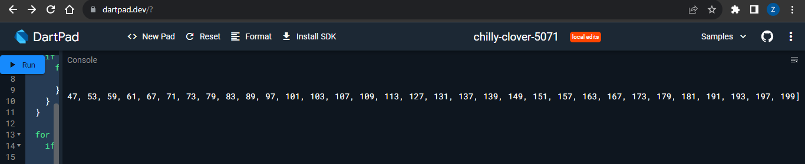

**Penjelasan:**
Pada program bilangan prima ini digunakan algoritma Sieve of Eratosthenes yang memiliki inti perulangan yang terus berjalan selama kuadrat dari "p" tidak melebihi batas "n". dalam loop bersarangnya adan digunakan untuk menandai semua kelipatan dari "p" bukan bilangan prima dengan mengubah isPrime[i] menjadi "false" dan kemudian mengambil bilangan yang bernilai "true" dan menyimpannya ke list "primes"