# Laporan Praktikum Pertemuan 4
## Tipe Data List, Set, Maps, dan Records

Zahra Annisa Wahono

3H/29

## **Praktikum 1 : Tipe Data List**

### **Langkah 1**

Ketik atau salin kode program berikut ke dalam void main().
```
var list = [1, 2, 3];
assert(list.length == 3);
assert(list[1] == 2);
print(list.length);
print(list[1]);

list[1] = 1;
assert(list[1] == 1);
print(list[1]);
```

### **Langkah 2**

Silakan coba eksekusi (Run) kode pada langkah 1 tersebut. Apa yang terjadi? Jelaskan!

**Jawab:** 

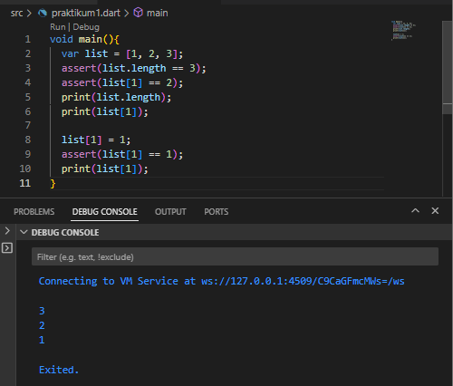

Deklarasi tipe data list menggunakan [].
Jika kondisi pada ```assert``` terpenuhi maka akan diprint panjang list, nilai list indeks 1, dan list indeks 1 yang baru seperti pada hasil run di atas. Hasil eksekusi menghasilkan print angka 3  2  1. 


### **Langkah 3**

Ubah kode pada langkah 1 menjadi variabel final yang mempunyai index = 5 dengan default value = null. Isilah nama dan NIM Anda pada elemen index ke-1 dan ke-2. Lalu print dan capture hasilnya.

Apa yang terjadi ? Jika terjadi error, silakan perbaiki.

**Jawab:** 
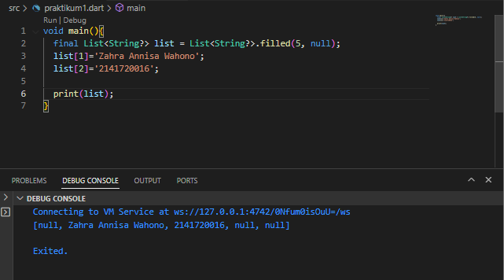 

Dibuat list dalam tipe string yang memiliki panjang list 5 dan secara default berisikan nilai null. Kemudian diisikan NIM dan Nama saya di di indeks 1 dan 2 berarti nilai indeks ke 0, 3, 4 masih null

# **Praktikum 2 : Tipe Data Set**

### **Langkah 1**

Ketik atau salin kode program berikut ke dalam fungsi main().
```
var halogens = {'fluorine', 'chlorine', 'bromine', 'iodine', 'astatine'};
print(halogens);
```
### **Langkah 2**

Silakan coba eksekusi (Run) kode pada langkah 1 tersebut. Apa yang terjadi? Jelaskan! Lalu perbaiki jika terjadi error.

**Jawab:** 

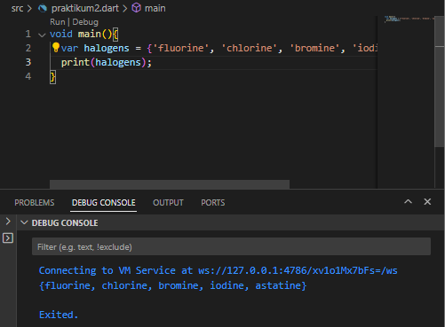 

Dideklarasikan variabel  halogens dengan tipe data set ditandai dengan {} yang berisikan nama namazat halogen. Lalu semua nilainya diprint. 


### **Langkah 3**

Tambahkan kode program berikut, lalu coba eksekusi (Run) kode Anda.
```
var names1 = <String>{};
Set<String> names2 = {}; // This works, too.
var names3 = {}; // Creates a map, not a set.

print(names1);
print(names2);
print(names3);
```
Apa yang terjadi ? Jika terjadi error, silakan perbaiki namun tetap menggunakan ketiga variabel tersebut. Tambahkan elemen nama dan NIM Anda pada kedua variabel Set tersebut dengan dua fungsi berbeda yaitu .add() dan .addAll(). Untuk variabel Map dihapus, nanti kita coba di praktikum selanjutnya.

**Jawab:** 

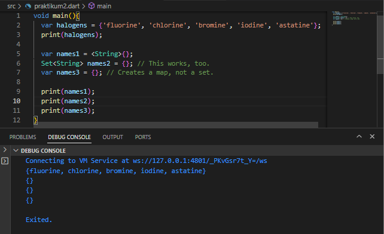 

Pada kode baris 5 dan 6 merupakan variasi dari deklarasi variabel Set namun jika seperti pada baris ke 7 {} kosong tanpa nilai maka itu akan mendeklarasikan variabel dengan tipe data Map bukan Set. Seperti pada langkah pertama jika tidak dideklarasikan nilai dari helogens maka nantinya variabel tersebut dideklarasikan sebagai Map.

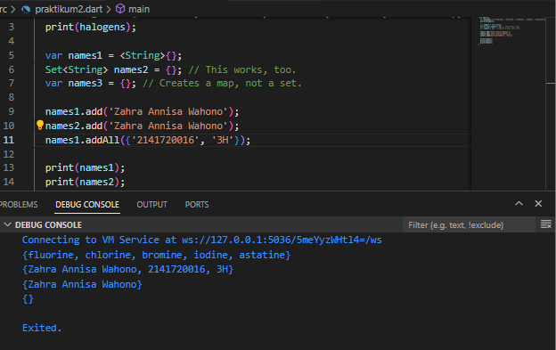

`add()` digunakan untuk menambahkan nilai pada suatu Set

`addAll()` digunakan untuk menambahkan beberapa nilai pada suatu Set sekaligus

# **Praktikum 3 : Tipe Data Maps**

### **Langkah 1**

Ketik atau salin kode program berikut ke dalam fungsi main().
```
var gifts = {
  // Key:    Value
  'first': 'partridge',
  'second': 'turtledoves',
  'fifth': 1
};

var nobleGases = {
  2: 'helium',
  10: 'neon',
  18: 2,
};

print(gifts);
print(nobleGases);
```
### **Langkah 2**

Silakan coba eksekusi (Run) kode pada langkah 1 tersebut. Apa yang terjadi? Jelaskan! Lalu perbaiki jika terjadi error.

**Jawab:** 

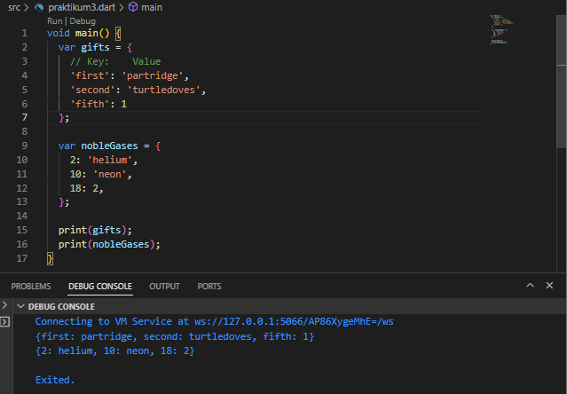 

Terdapat 2 variabel  bertipe Map yaitu, gifts dan nobleGases yang masing masing memiliki key dan value. Key pada gifts bertipe string serangkan pada nobleGases bertipe int. 

### **Langkah 3**

Tambahkan kode program berikut, lalu coba eksekusi (Run) kode Anda.
```
var mhs1 = Map<String, String>();
gifts['first'] = 'partridge';
gifts['second'] = 'turtledoves';
gifts['fifth'] = 'golden rings';

var mhs2 = Map<int, String>();
nobleGases[2] = 'helium';
nobleGases[10] = 'neon';
nobleGases[18] = 'argon';
```
Apa yang terjadi ? Jika terjadi error, silakan perbaiki.

Tambahkan elemen nama dan NIM Anda pada tiap variabel di atas (gifts, nobleGases, mhs1, dan mhs2). Dokumentasikan hasilnya dan buat laporannya!

**Jawab:** 

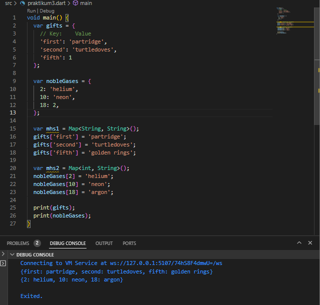 

Pada Map mhs1 dideklarasikan bahwa pasangan key value berupa String, maka jika salah satu atau keduanya berupa int maka akan terjadi error karena tidak sesui format yang telah dideklarasikan. Begitu pula pada Map mhs2 dideklarasikan bahwa pasangan key berupa int dan value berupa String maka jika tidak sesuai akan terjadi error.

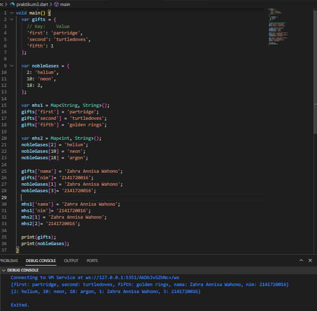 


# **Praktikum 4 : Tipe Data List: Spread dan Control-flow Operators**

### **Langkah 1**

Ketik atau salin kode program berikut ke dalam fungsi main().
```
var list = [1, 2, 3];
var list2 = [0, ...list];
print(list1);
print(list2);
print(list2.length);
```
### **Langkah 2**

Silakan coba eksekusi (Run) kode pada langkah 1 tersebut. Apa yang terjadi? Jelaskan! Lalu perbaiki jika terjadi error.

**Jawab:** 

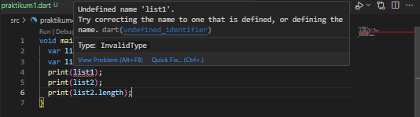 

Terjadi error karena penamaan list tidak sesuai.

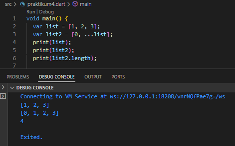 
Pendeklarasian list2 menggunakan spread yang memungkinkan untuk mengekstrak nilai dari list yang sudah ada. list2 berisikan 0 dan nilai variabel list.


### **Langkah 3**

Tambahkan kode program berikut, lalu coba eksekusi (Run) kode Anda.
```
list1 = [1, 2, null];
print(list1);
var list3 = [0, ...?list1];
print(list3.length);
```
Apa yang terjadi ? Jika terjadi error, silakan perbaiki.

Tambahkan variabel list berisi NIM Anda menggunakan Spread Operators. 

**Jawab:** 

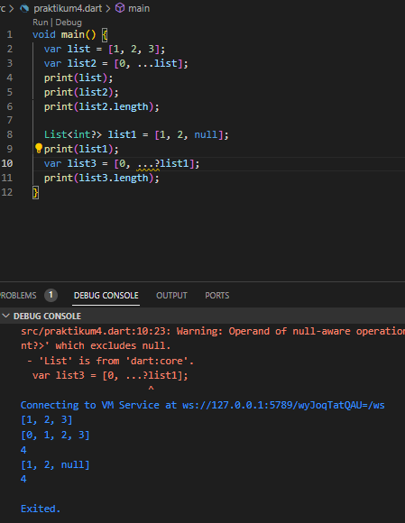 

Terdapat peringatan bahwa kita mendeklarasikan list3 yang tidak nullable dengan mengekstraksi list 1 yang nullabel dan memiliki nilai null di indeks ke 2 nya.

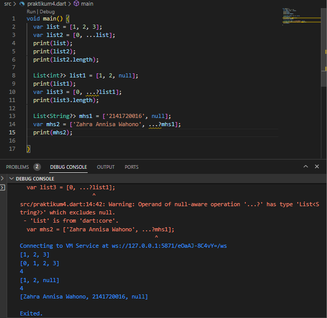 


### **Langkah 4**

Tambahkan kode program berikut, lalu coba eksekusi (Run) kode Anda.
```
var nav = ['Home', 'Furniture', 'Plants', if (promoActive) 'Outlet'];
print(nav);
```
Apa yang terjadi ? Jika terjadi error, silakan perbaiki. Tunjukkan hasilnya jika variabel promoActive ketika true dan false.

**Jawab:** 

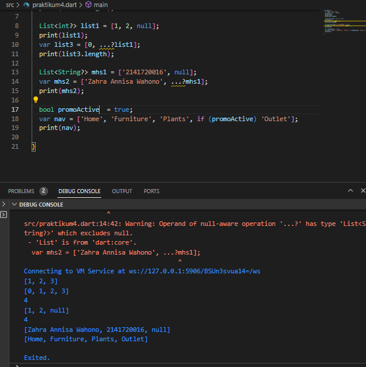 

Terdapat if di dalam list nav. Jika kondisi yang ada pada if bernilai true (dalam hal ini promoActive) maka 'Outlet' akan termasuk pada anggota list nav jika false maka tidak.

### **Langkah 5**

Tambahkan kode program berikut, lalu coba eksekusi (Run) kode Anda.
```
var nav2 = ['Home', 'Furniture', 'Plants', if (login case 'Manager') 'Inventory'];
print(nav2);
```
Apa yang terjadi ? Jika terjadi error, silakan perbaiki. Tunjukkan hasilnya jika variabel login mempunyai kondisi lain.

**Jawab:** 

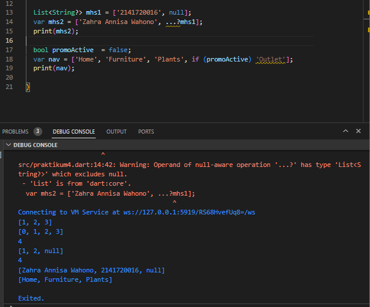 

`case` digunakan untuk pengecekan kecocokan pada var login apakah bernilai 'Manager' jika bernilai true maka 'Inventory' akan muncul pada list.

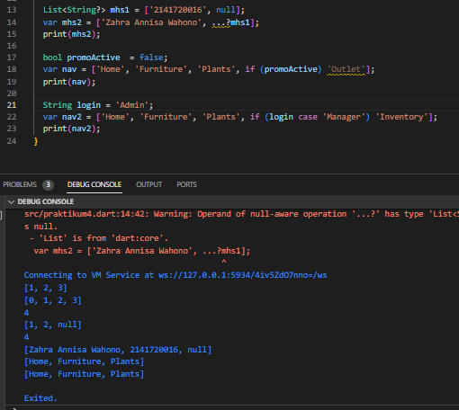

`case` digunakan untuk pengecekan kecocokan pada var login apakah bernilai 'Manager' jika bernilai false maka 'Inventory' tidak akan muncul pada list.

### **Langkah 6**

Tambahkan kode program berikut, lalu coba eksekusi (Run) kode Anda.
```
var listOfInts = [1, 2, 3];
var listOfStrings = ['#0', for (var i in listOfInts) '#$i'];
assert(listOfStrings[1] == '#1');
print(listOfStrings);
```

Apa yang terjadi ? Jika terjadi error, silakan perbaiki. Jelaskan manfaat Collection For.

**Jawab:** 

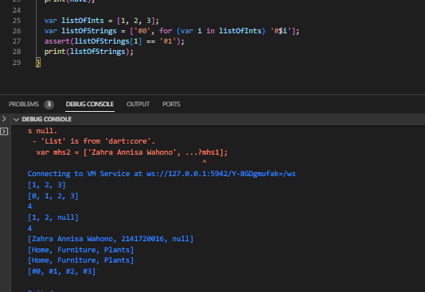

Pengekstraksian list dengan menggunakan perulangan for juga dapat dilakukan untuk menyesuaikan output dari ekstraksi list.

"Collection for" adalah konstruksi yang digunakan untuk membuat dan menginisialisasi koleksi seperti List, Set, dan Map dengan sintaks yang lebih ringkas. Memungkinkan kita untuk mentransformasikan hasil ekstraksi sesuai kebutuhan. 

# **Praktikum 5 : Tipe Data Records**

### **Langkah 1**
Ketik atau salin kode program berikut ke dalam fungsi main().
```
var record = ('first', a: 2, b: true, 'last');
print(record)
```

### **Langkah 2**

Silakan coba eksekusi (Run) kode pada langkah 1 tersebut. Apa yang terjadi? Jelaskan! Lalu perbaiki jika terjadi error.

**Jawab:** 

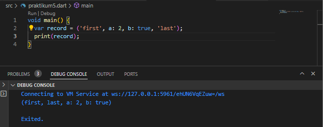

Collection record dapat menyimpan data dengan berbagai tipe dalam satu kesatuan mulai dari String, list, Map dan lainnya. Pada saat print data dengan tipe data yang sama akan dikumpulkan dan diprint berurutan namun tidak mempengaruhi indeks.

### **Langkah 3**
Tambahkan kode program berikut di luar scope void main(), lalu coba eksekusi (Run) kode Anda.
```
(int, int) tukar((int, int) record) {
  var (a, b) = record;
  return (b, a);
}
```

Apa yang terjadi ? Jika terjadi error, silakan perbaiki. Gunakan fungsi tukar() di dalam main() sehingga tampak jelas proses pertukaran value field di dalam Records.

**Jawab:** 

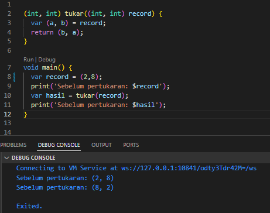
Record juga memudahkan kita dalam menukarkan field tertentu dengan menggunakan fungsi tukar yang akan mengembalikan nilai dengan format yang kita inginkan.

### **Langkah 4**

Tambahkan kode program berikut di dalam scope void main(), lalu coba eksekusi (Run) kode Anda.
```
// Record type annotation in a variable declaration:
(String, int) mahasiswa;
print(mahasiswa);
```
Apa yang terjadi ? Jika terjadi error, silakan perbaiki. Inisialisasi field nama dan NIM Anda pada variabel record mahasiswa di atas.

**Jawab:** 

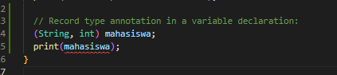

Terjadi erorr karena belum diinisialisasikan nilainya

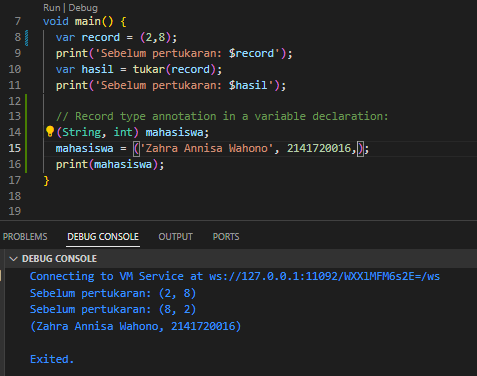


### **Langkah 5**
Tambahkan kode program berikut di dalam scope void main(), lalu coba eksekusi (Run) kode Anda.
```
var mahasiswa2 = ('first', a: 2, b: true, 'last');

print(mahasiswa2.$1); // Prints 'first'
print(mahasiswa2.a); // Prints 2
print(mahasiswa2.b); // Prints true
print(mahasiswa2.$2); // Prints 'last'
```
Apa yang terjadi ? Jika terjadi error, silakan perbaiki. Gantilah salah satu isi record dengan nama dan NIM Anda

**Jawab:** 

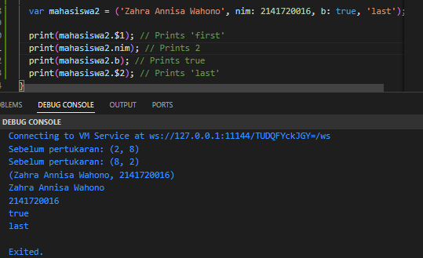

Berbeda dengan Collection lainnya, indeks pada record dimulai dari 1 dan untuk memanggilnya diperlukan tanda $. Dan kita juga bisa memanggil berdasarkan key jika itu merupakan tipe key-value seperti map.


## **Tugas Praktikum**

1. Jelaskan yang dimaksud Functions dalam bahasa Dart!

    **Jawab:** 
    
    Functions adalah kumpulan dari beberapa kode yang digunakan untuk melakukan tugas tertentu berdasarkan input tertentu. Digunakan untuk mengorganisasi program menjadi bagian bagian kecil yang tiap bagiannya dapat digunakan kembali.

2. Jelaskan jenis-jenis parameter di Functions beserta contoh sintaksnya!

    **Jawab:** 

    Terdapat 2 jenis parameter yaitu, `Named parameter` dan `Optional positional parameters`.

    * **Named Parameters** merupakan  parameter yang bersifat opsional kecuali jika mereka secara eksplisit ditandai sebagai wajib (required).
    Saat mendefinisikan fungsi, menggunakan {param1, param2, ...} untuk menentukan parameternya.
    Jika tidak diberikan nilai default atau menandai sebuah nemed parameter sebagai required, tipe data parameter tersebut harus dapat bernilai null karena nilai defaultnya akan null.
        ```
        void enableFlags({bool? bold, bool? hidden}) {...}
        ```

        Saat memanggil fungsi, dengan menyebutkan nama parameternya 
        
        Contohnya:
        ```
        enableFlags(bold: true, hidden: false);
        ```

    * **Optional Positional Parameters** parameter yang diterima oleh fungsi berdasarkan urutan posisi mereka dalam daftar parameter.
    Anda dapat memberikan nilai untuk positional parameters dengan urutan yang sesuai saat memanggil fungsi. Ditandai dengan parameter berada dalam []

        ```
        String say(String from, String msg, [String? device]) {
            var result = '$from says $msg';
            if (device != null) {
                result = '$result with a $device';
            }
            return result;
        }
        ```
3. Jelaskan maksud Functions sebagai first-class objects beserta contoh sintaknya!

    **Jawab:** 

    Konsep ini memungkinkan untuk meneruskan fungsi sebagai parameter ke fungsi lain dan menetapkannya ke variabel, termasuk penggunaan fungsi anonim. 

        ```
        void printElement(int element) {
            print(element);
        }

        var list = [1, 2, 3];

        // Pass printElement as a parameter.
        list.forEach(printElement);
        ```
4. Apa itu Anonymous Functions? Jelaskan dan berikan contohnya!

    **Jawab:** 

    Fungsi anonim (anonymous functions) adalah jenis fungsi yang tidak memiliki nama tertentu. Fungsi ini juga disebut lambda atau closure dalam beberapa konteks. Fungsi anonim sangat berguna dalam pemrograman karena Anda dapat membuat dan menggunakan fungsi ini tanpa harus memberikan nama khusus. Fungsi ini sering digunakan dalam situasi di mana Anda perlu menyimpan tindakan atau operasi tertentu yang dapat digunakan atau diberikan ke tempat lain dalam kode Anda. 

    Sintaksis fungsi anonim mirip dengan fungsi bernama. Fungsi anonim dapat memiliki nol atau lebih parameter, yang diletakkan dalam tanda kurung dan dapat memiliki tipe data (opsional). Blok kode yang mendefinisikan perilaku fungsi tersebut diletakkan di dalam tanda kurung kurawal {}.
    ```
    const list = ['apples', 'bananas', 'oranges'];
    list.map((item) {
        return item.toUpperCase();
    }).forEach((item) {
        print('$item: ${item.length}');
    });
    ```
5. Jelaskan perbedaan Lexical scope dan Lexical closures! Berikan contohnya!

    **Jawab:** 

    **Lexical Scope** adalah tentang sejauh mana variabel dapat diakses dalam kode berdasarkan struktur blok kode, dan variabel tersebut hanya dapat diakses dalam lingkup (scope) di mana mereka didefinisikan. Ini adalah tentang batasan akses variabel.
    ```
    bool topLevel = true;

    void main() {
    var insideMain = true;

    void myFunction() {
        var insideFunction = true;

        void nestedFunction() {
            var insideNestedFunction = true;

            assert(topLevel);
            assert(insideMain);
            assert(insideFunction);
            assert(insideNestedFunction);
            }
        }
    }
    ```

    **Lexical Closures** adalah tentang kemampuan sebuah fungsi untuk mengakses dan "mengingat" variabel dari lingkup (scope) tempat fungsi tersebut didefinisikan, bahkan setelah lingkup tersebut selesai dieksekusi. Ini adalah tentang menyimpan dan mengakses data yang masih relevan dalam fungsi.
    ```
    /// Returns a function that adds [addBy] to the
    /// function's argument.
    Function makeAdder(int addBy) {
    return (int i) => addBy + i;
    }

    void main() {
    // Create a function that adds 2.
    var add2 = makeAdder(2);

    // Create a function that adds 4.
    var add4 = makeAdder(4);

    assert(add2(3) == 5);
    assert(add4(3) == 7);
    }
    ```

6. Jelaskan dengan contoh cara membuat return multiple value di Functions!

    **Jawab:** 

    Fungsi biasanya mengembalikan satu nilai (hasil) saja. Namun, juga dapat mengembalikan beberapa nilai sekaligus (return multiple values) dengan beberapa pendekatan yang berbeda. 

    - Menggunakan Objek atau Map:

        ```
        Map<String, dynamic> getPersonInfo() {
            var person = {
                'name': 'John Doe',
                'age': 30,
                'address': '123 Main Street'
            };
        return person;
        }

        void main() {
            var info = getPersonInfo();
            print('Nama: ${info['name']}');
            print('Usia: ${info['age']}');
            print('Alamat: ${info['address']}');
        }
        ```

    - Menggunakan List atau Tuple:
        ```
        List<dynamic> getCoordinates() {
            var latitude = 40.7128;
            var longitude = -74.0060;
            return [latitude, longitude];
        }

        void main() {
            var coordinates = getCoordinates();
            var latitude = coordinates[0];
            var longitude = coordinates[1];
            print('Latitude: $latitude');
            print('Longitude: $longitude');
        }
        ```
    - Menggunakan Class atau Object:
        ```
        class Location {
            double latitude;
            double longitude;

            Location(this.latitude, this.longitude);
        }

        Location getCoordinates() {
            return Location(40.7128, -74.0060);
        }

        void main() {
            var location = getCoordinates();
            print('Latitude: ${location.latitude}');
            print('Longitude: ${location.longitude}');
        }
        ```
