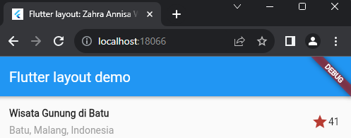
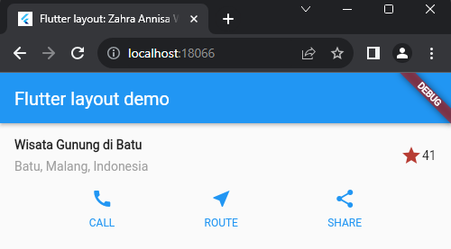
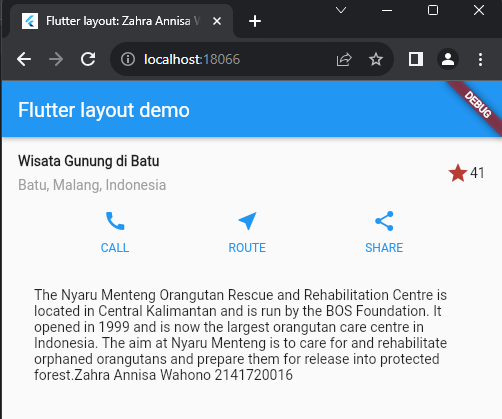

# Laporan Praktikum Pertemuan 7
## Layout dan Navigasi

Zahra Annisa Wahono

3H/29

## **Praktikum 1 : Membangun Layout di Flutter**

## **Praktikum 2: Implementasi button row**

## **Praktikum 3: Implementasi text section**

## **Praktikum 4: Implementasi image section**

